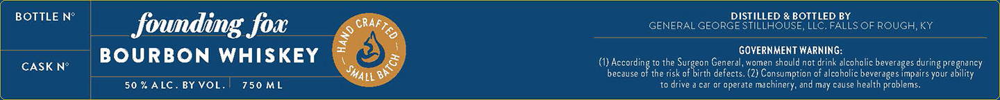

# TTB COLA Label Images - TTBID 26001001000031

**Brand Name:** FOUNDING FOX

**Issue Date:** 01/06/2026

**Origin Code:** 22

**Product Class/Type:** 141

**Source:** [TTB Public COLA Registry](https://ttbonline.gov/colasonline/viewColaDetails.do?action=publicFormDisplay&ttbid=26001001000031)

## Label Images

### Label 1

## Extracted Label Text

*Text extracted via OCR - may contain errors*

### Label 1

BOTTLE N°

DISTILLED & BOTTLED BY

GENERAL GEORGE STILLHOUSE, LLC. FALLS OF ROUGH, KY

founding fox

GOVERNMENT WARNING:

CASK N°

1 BOURBON WHISKEY,

(1) Accordin

to the Surgeon General, women should not drink alcoholic beverages during pregnancy

because o

f

the risk of birth defects, (2) Consumption of alcoholic beverages impairs your ability

|

50 % ALC. BY VOL.

750 ML

10 drive a car or operate machinery, and may cause health problems.
