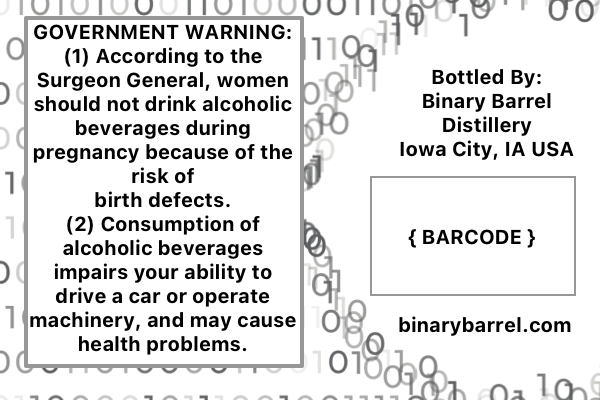
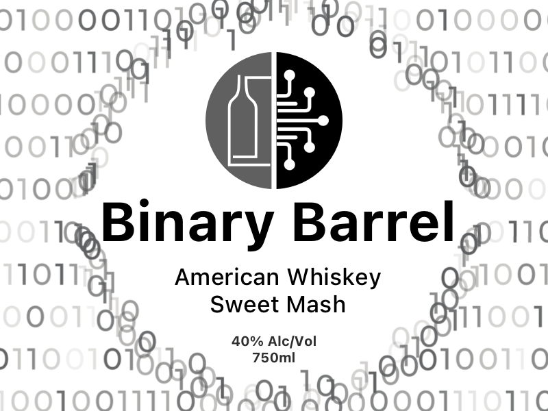

# TTB COLA Label Images - TTBID 26001001000060

**Brand Name:** BINARY BARREL

**Fanciful Name:** AMERICAN WHISKEY SWEET MASH

**Issue Date:** 01/09/2026

**Origin Code:** 20

**Product Class/Type:** 140

**Source:** [TTB Public COLA Registry](https://ttbonline.gov/colasonline/viewColaDetails.do?action=publicFormDisplay&ttbid=26001001000060)

## Label Images

### Back Label

### Front Label

## Extracted Label Text

*Text extracted via OCR - may contain errors*

*1 image(s) excluded: text did not meet readability threshold*

### Back Label

3IUILILU
GOVERNMENT
WARNING: ] 3a|
WARNING:
Q U
(1) According to the
110
Surgeon General, women
Bottled By:
)
should not drink alcoholic
Binary Barrel
beverages during
Distillery
pregnancy because of the
Iowa
IA USA
risk of
birth defects_
(2) Consumption of
BARCODE }
alcoholic beverages
)
impairs your ability to
drive a car or operate
Hmachinery, and may cause
binarybarrel.com
health problems_
0
City ,
