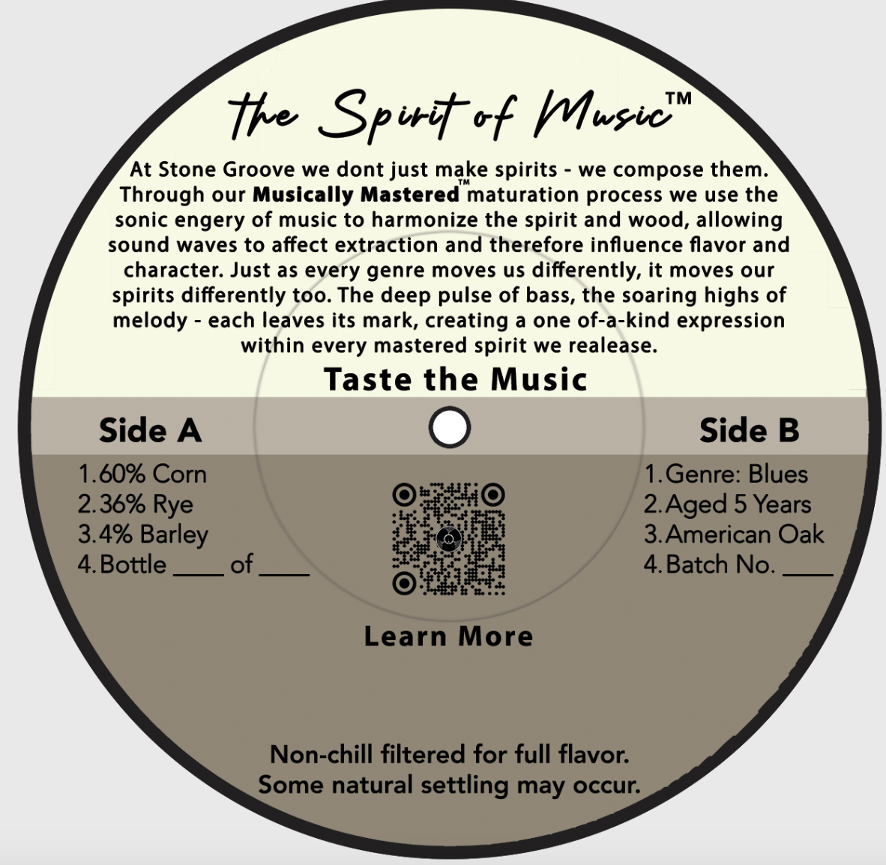
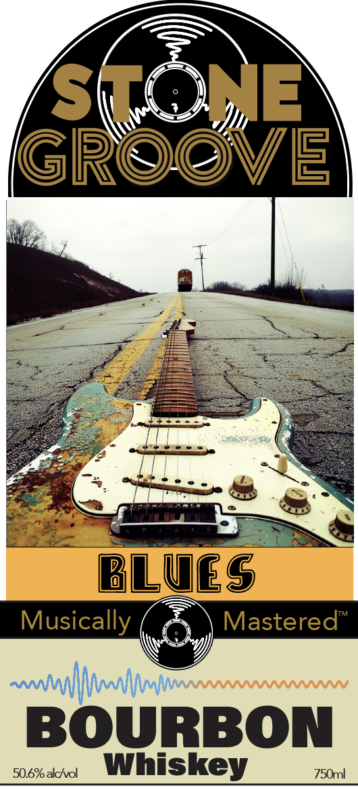

# TTB COLA Label Images - TTBID 26002001000216

**Brand Name:** STONE GROOVE

**Issue Date:** 03/18/2026

**Origin Code:** 01

**Product Class/Type:** 141

**Source:** [TTB Public COLA Registry](https://ttbonline.gov/colasonline/viewColaDetails.do?action=publicFormDisplay&ttbid=26002001000216)

## Label Images

### Back Label

### Front Label

## Extracted Label Text

*Text extracted via OCR - may contain errors*

**Detected Age:** 5 Years

### Back Label

TM
te Spiit vf Mwsie"
At Stone Groove we dont just make spirits
we compose them.
Through our Musically Mastered' maturation process we use the
sonic engery of music to harmonize the spirit and wood, allowing
sound waves to affect extraction and therefore influence flavor and
character: Just as every genre moves us differently, it moves our
spirits differently too. The deep pulse of bass, the soaring highs of
melody
each leaves its mark, creating a one of-a-kind expression
within every mastered spirit we realease:
Taste the Music
Side A
Side B
1.60% Corn
1.Genre: Blues
2.36% Rye
2.Aged 5 Years
3.4% Barley
3.American Oak
4.Bottle
of
4.Batch No.
Learn More
Non-chill filtered for full flavor:
Some natural
settling may occur:

### Front Label

Ss we Hj) [=
GROOVE
NR . fe

4

7? cee oS

a aes
BLUES

Musical Oa eMastored
naval ono

BOURBON
xmas Whiskey iin
