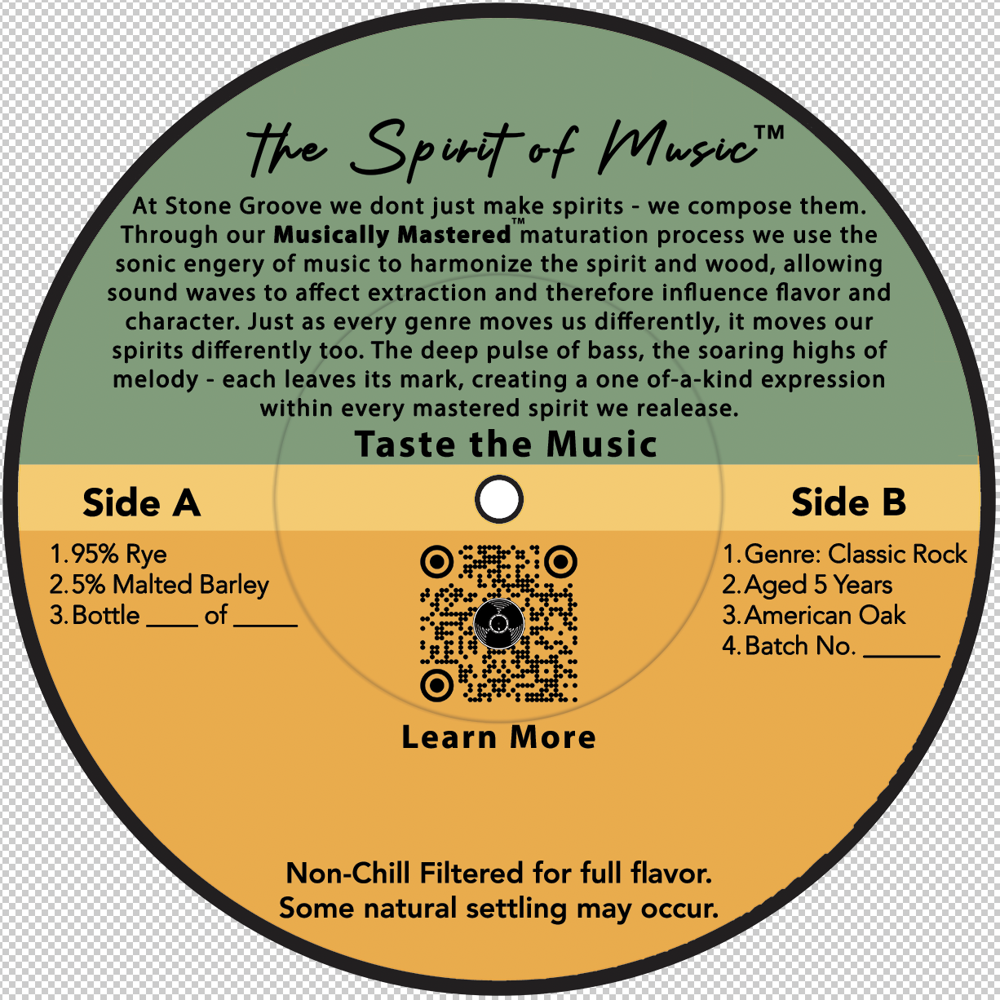
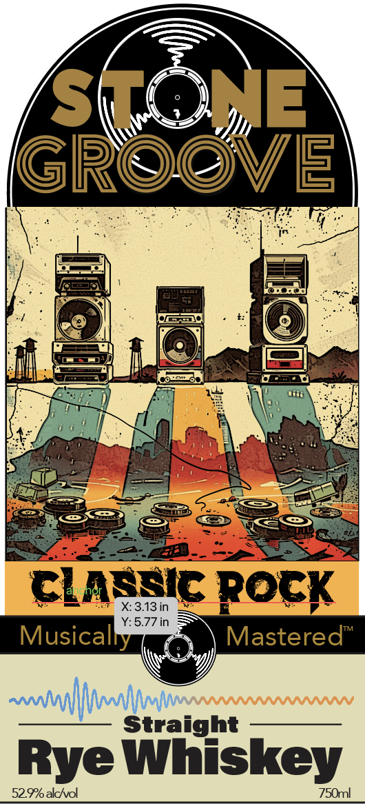
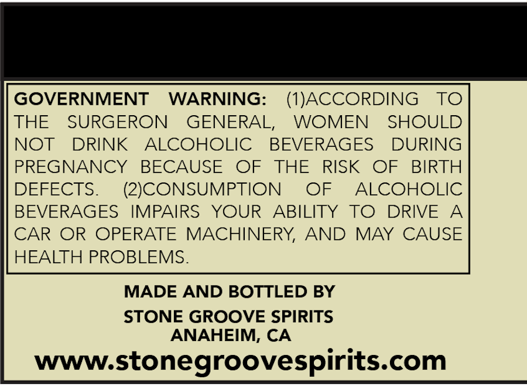

# TTB COLA Label Images - TTBID 26002001000222

**Brand Name:** STONE GROOVE

**Issue Date:** 03/18/2026

**Origin Code:** 01

**Product Class/Type:** 102

**Source:** [TTB Public COLA Registry](https://ttbonline.gov/colasonline/viewColaDetails.do?action=publicFormDisplay&ttbid=26002001000222)

## Label Images

### Back Label

### Front Label

### Label 2

### Label 3

## Extracted Label Text

*Text extracted via OCR - may contain errors*

*1 image(s) excluded: text did not meet readability threshold*

**Detected Age:** 5 Years

### Back Label

Seat oat

The Sprit of Whusie

At Stone Groove we dont just make spirits - we compose them.

Through our Musically Mastered maturation process we use the

sonic engery of music to harmonize the spirit and wood, allowing

sound waves to affect extraction and therefore influence flavor and

character. Just as every genre moves us differently, it moves our

spirits differently too. The deep pulse of bass, the soaring highs of

melody - each leaves its mark, creating a one of-a-kind expression

within every mastered spirit we realease.

Taste the Music

Side A

Side B

1.Genre: Classic Rock

1.95% Rye

2.5% Malted Barley

2.Aged 5 Years

3.Bottle

of

3.American Oak

steee, $

4. Batch No

tREL

#3.

LF:

Learn More

Non-Chill Filtered for full flavor.

Some natural settling may occur.

### Front Label

Sht
ME
GROOVE
classic Rock
X3.13in
Y: 5.77in
Musically
Mastered"
~m
Straight
Rye Whiskey
52.9alchvol
750ml

### Label 2

GOVERNMENT
WARNING:
(IJACCORDING
TO
THE
SURGERON
GENERAL,
WOMEN
SHOULD
NOT
DRINK
ALCOHOLIC
BEVERAGES
DURING
PREGNANCY
BECAUSE
OF
THE
RISK
OF
BIRTH
DEFECTS:
(2JCONSUMPTION
OF
ALCOHOLIC
BEVERAGES
IMPAIRS
YOUR
ABILITY
TO
DRIVE
A
CAR OR OPERATE
MACHINERY,
AND
MAY CAUSE
HEALTH PROBLEMS:
MADE AND BOTTLED BY
STONE GROOVE SPIRITS
ANAHEIM, CA
wwwstonegroovespirits com
