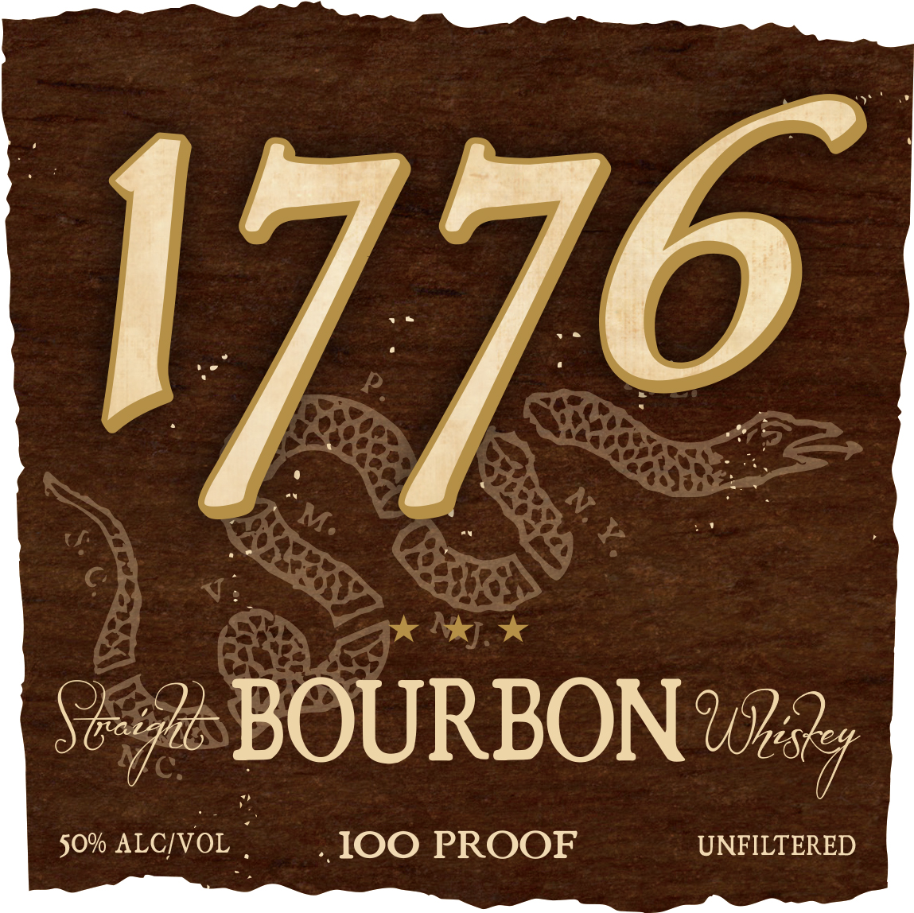
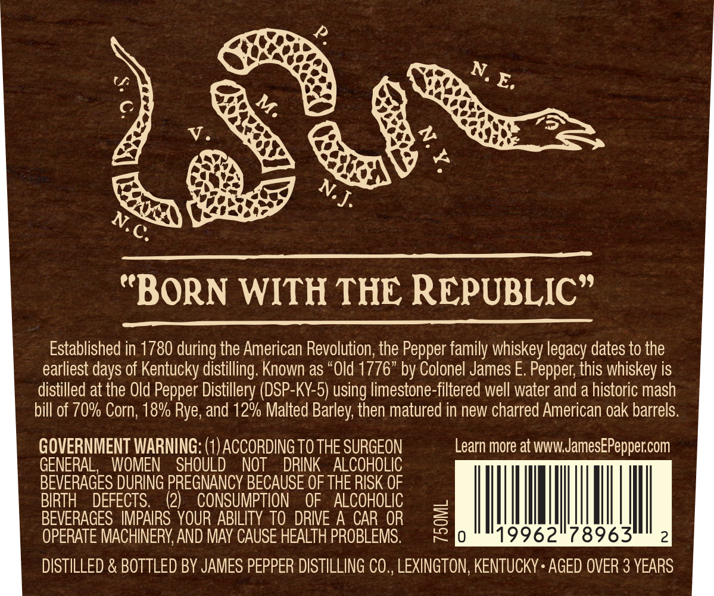

# TTB COLA Label Images - TTBID 26004001000074

**Brand Name:** 1776

**Issue Date:** 01/06/2026

**Origin Code:** 22

**Product Class/Type:** 101

**Source:** [TTB Public COLA Registry](https://ttbonline.gov/colasonline/viewColaDetails.do?action=publicFormDisplay&ttbid=26004001000074)

## Label Images

### Label 1

### Label 2

## Extracted Label Text

*Text extracted via OCR - may contain errors*

### Label 1

I 76

ik Nay oo

. BOURBON Wily

. LOO PROOF

FILTERED

### Label 2

Lh

LG

op

a6

406

LN

We

ea) ww

a9,

a0

See

(a

“BORN WITH THE REPUBLIC”

Established in 1780 during the American Revolution, the Pepper family whiskey legacy dates to the

earliest days of Kentucky distilling. Known as “Old 1776” by Colonel James E. Pepper, this whiskey is

distilled at the Old Pepper Distillery (DSP-KY-5) using limestone-filtered well water and a historic mash

bill of 70% Corn, 18% Rye, and 12% Malted Barley, then matured in new charred American oak barrels.

ape Be a (1) ACCORDING TO THE SURGEON

Learn more at www.JamesEPepper.com

GENERAL, WOMEN

SHOU

NOT DRINK ALCOHOLIC

BEVERAGES DURING PREGNANCY BECAUSE OF THE RISK OF

BIRTH DEFECTS.

(2) CONSUMPTION OF ALCOHOLIC

|

|

BEVERAGES IMPAIRS YOUR ABILITY TO DRIVE A CAR OR

|

OPERATE MACHINERY, AND MAY CAUSE HEALTH PROBLEMS

DISTILLED & BOTTLED BY JAMES PEPPER DISTILLING CO., LEXINGTON, KENTUCKY + AGED OVER 3 YEARS
