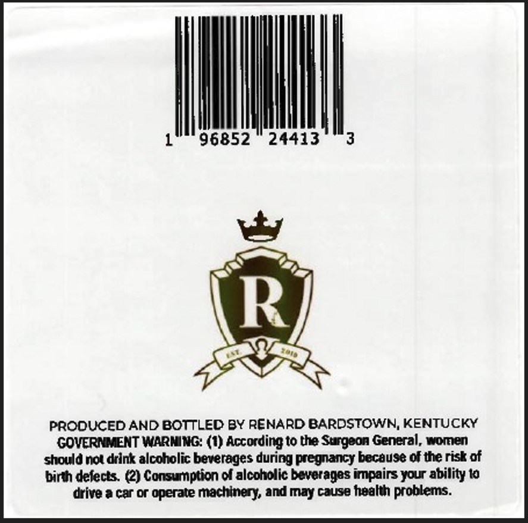
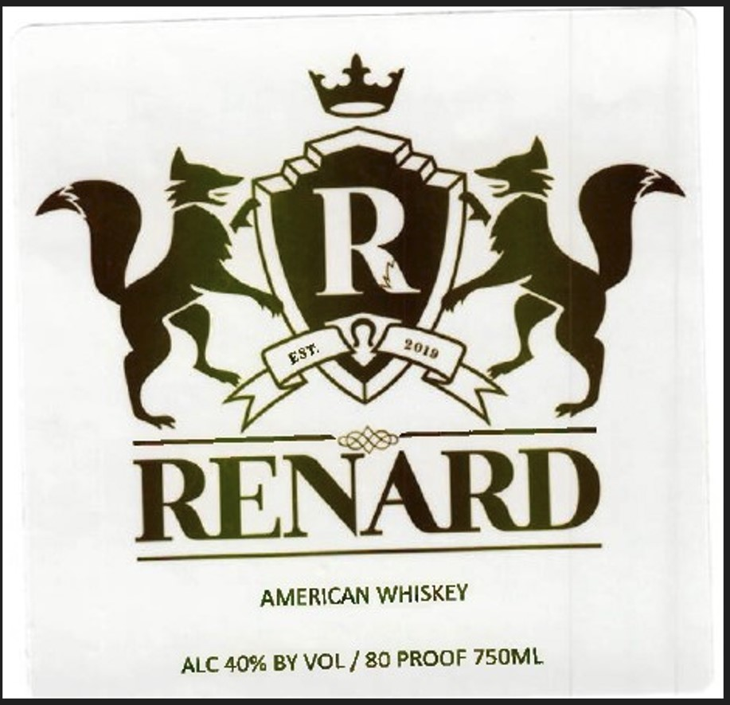

# TTB COLA Label Images - TTBID 26005001000037

**Brand Name:** RENARD

**Issue Date:** 01/06/2026

**Origin Code:** 22

**Product Class/Type:** 140

**Source:** [TTB Public COLA Registry](https://ttbonline.gov/colasonline/viewColaDetails.do?action=publicFormDisplay&ttbid=26005001000037)

## Label Images

### Back Label

### Label 1

## Extracted Label Text

*Text extracted via OCR - may contain errors*

### Back Label

IMM

96852 24413

|

PRODUCED AND BOTTLED BY RENARD BARDSTOWN, KENTUCKY
GOVERNMENT WARNING: (1) According to the Surgeon General, women
should not drink alcoholic beverages during pregnancy because of the risk of
birth defects. (2) Consumption of alcoholic beverages impairs your ability to
drive a car or operate machinery, and may cause health problems.

### Label 1

Tn
“we a wy ~— an
aay
Slice.

RENARD

RENARD
AMERICAN WHISKEY

ALC 40% BY VOL / 80 PROOF 750ML
