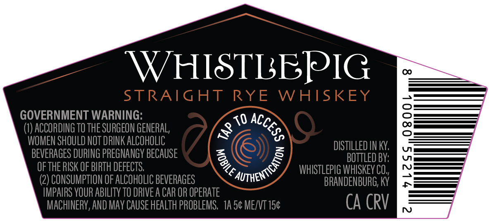
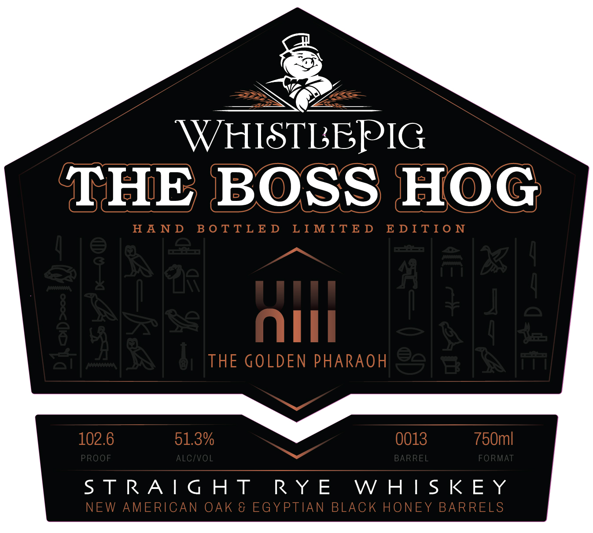
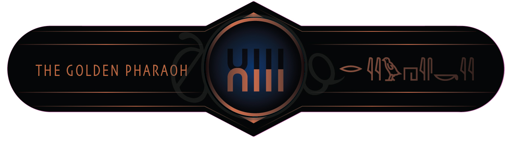

# TTB COLA Label Images - TTBID 26005001000084

**Brand Name:** WHISTLEPIG

**Issue Date:** 01/06/2026

**Origin Code:** 22

**Product Class/Type:** 102

**Source:** [TTB Public COLA Registry](https://ttbonline.gov/colasonline/viewColaDetails.do?action=publicFormDisplay&ttbid=26005001000084)

## Label Images

### Back Label

### Label 1

### Label 2

## Extracted Label Text

*Text extracted via OCR - may contain errors*

### Back Label

WHISTLBPIG

GOVERNMENT WARNING:

(1) ACCORDING TO THE SURGEON GENERAL,

‘i ACG.

WOMEN SHOULD NOT DRINK ALCOHOLIC

=

BEVERAGES DURING PREGNANGY BECAUSE

=

3]

Ss

DISTILLED IN KY.

OF THE RISK OF BIRTH DEFECTS.

&

(2) CONSUMPTION OF ALCOHOLIC BEVERAGES

Care

WHISTLEPIG WHISKEY C0,,

IMPAIRS YOUR ABILITY TO DRIVE A CAR OR OPERATE

BRANDENBURG, KY

CA CRV

MACHINERY, AND MAY CAUSE HEALTH PROBLEMS. 1A 5¢ ME/VT 15¢

### Label 1

WHISTLBPIG

THE BOSS HOG
