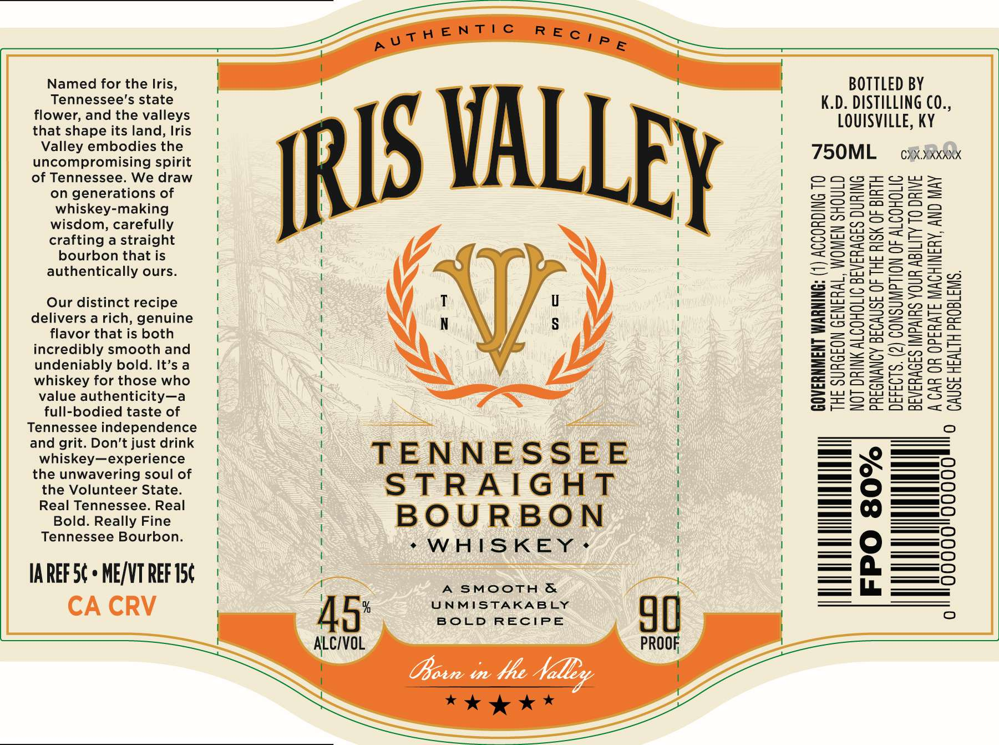

# TTB COLA Label Images - TTBID 26005001000127

**Brand Name:** IRIS VALLEY

**Issue Date:** 01/06/2026

**Origin Code:** 22

**Product Class/Type:** 101

**Source:** [TTB Public COLA Registry](https://ttbonline.gov/colasonline/viewColaDetails.do?action=publicFormDisplay&ttbid=26005001000127)

## Label Images

### Front Label

## Extracted Label Text

*Text extracted via OCR - may contain errors*

### Front Label

Named for the Iris,
Tennessee's state
flower, and the valleys
that shape its land, Iris
Valley embodies the
uncompromising spirit
of Tennessee. We draw
on generations of
whiskey-making
wisdom, carefully
crafting a straight
bourbon that is
authentically ours.

Our distinct recipe
delivers a rich, genuine
flavor that is both
incredibly smooth and
undeniably bold. It’s a
whiskey for those who
value authenticity—a
full-bodied taste of
Tennessee independence
and grit. Don’t just drink
whiskey—experience
the unwavering soul of
the Volunteer State.
Real Tennessee. Real
Bold. Really Fine
Tennessee Bourbon.

IAREF 5¢ » ME/VT REF 15¢
CA CRV

A SMOOTH &
UNMISTAKABLY
BOLD RECIPE

BOTTLED BY
K.D. DISTILLING CO.,
LOUISVILLE, KY

T5OML  ciisikkk

0
D
G
H
¢

,

(1) ACCORDING T

THE SURGEON GENERAL, WOMEN SHOUL
NOT DRINK ALCOHOLIC BEVERAGES DURIN

PREGNANCY BECAUSE OF THE RISK OF BIRT

DEFECTS. (2) CONSUMPTION OF ALCOHOLI
BEVERAGES IMPAIRS YOUR ABILITY T0 DRIVE
A CAR OR OPERATE MACHINERY, AND MAY

GOVERNMENT WARNING:
© CAUSE HEALTH PROBLEMS.

DUNO CM
FPO 80%
