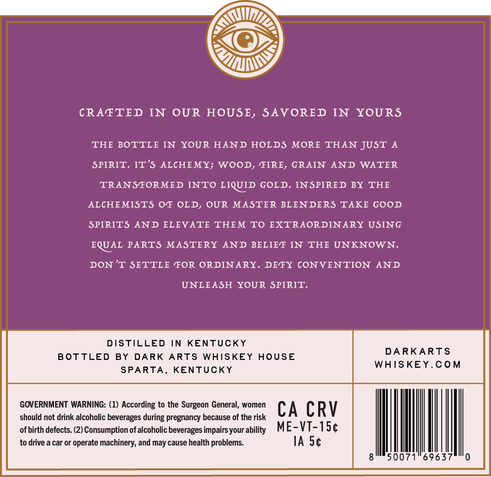
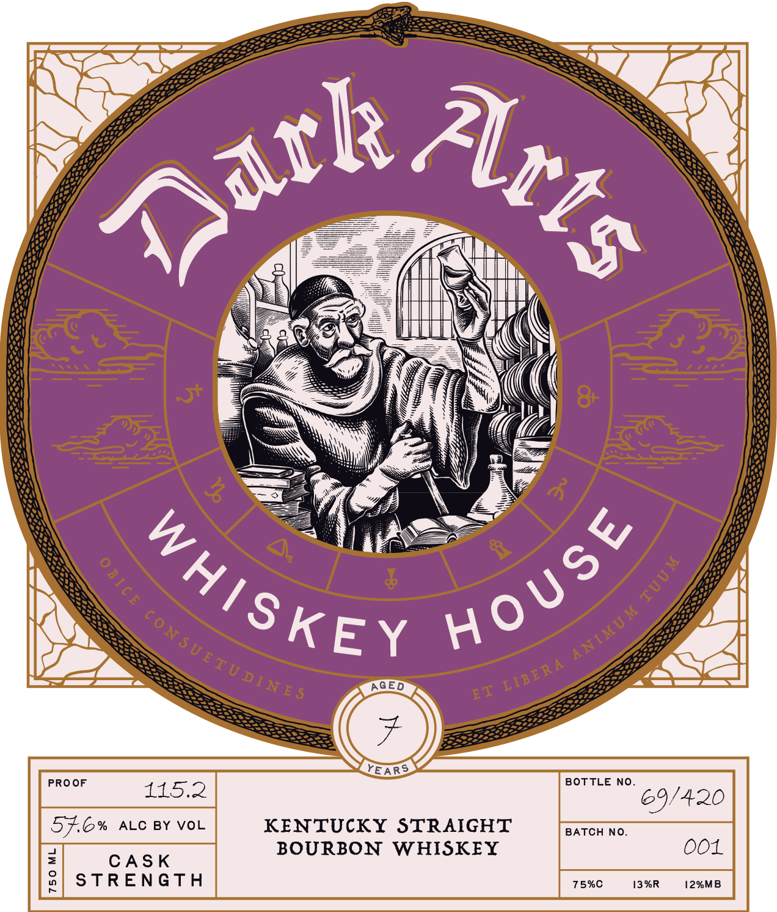
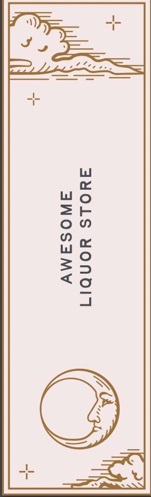

# TTB COLA Label Images - TTBID 26005001000453

**Brand Name:** DARK ARTS WHISKEY HOUSE

**Fanciful Name:** CASK STRENGTH

**Issue Date:** 01/06/2026

**Origin Code:** 22

**Product Class/Type:** 101

**Source:** [TTB Public COLA Registry](https://ttbonline.gov/colasonline/viewColaDetails.do?action=publicFormDisplay&ttbid=26005001000453)

## Label Images

### Back Label

### Front Label

### Label 3

### Label 4

## Extracted Label Text

*Text extracted via OCR - may contain errors*

*2 image(s) excluded: text did not meet readability threshold*

### Back Label

MT

SS

LDS

@)

Ty,

CRAFTED IN OUR HOUSE, SAVORED IN YOURS

THE BOTTLE IN YOUR HAND HOLDS MORE THAN JUST A

SPIRIT. IT’S ALCHEMY; WOOD, FIRE, GRAIN AND WATER

TRANSFORMED INTO LIQUID GOLD, INSPIRED BY THE

ALCHEMISTS OF OLD, OUR MASTER BLENDERS TAKE GOOD

SPIRITS AND ELEVATE THEM TO EXTRAORDINARY USING

EQUAL PARTS MASTERY AND BELIEF IN THE UNKNOWN.

DON’T SETTLE FOR ORDINARY. DEFY CONVENTION AND

UNLEASH YOUR SPIRIT.

DISTILLED IN KENTUCKY

BOTTLED BY DARK ARTS WHISKEY HOUSE

DARKARTS

WHISKEY.COM

SPARTA, KENTUCKY

GOVERNMENT WARNING: (1) According to the Surgeon General, women

CA CRV

should not drink alcoholic beverages during pregnancy because of the

of birth defects. (2) Consumption of alcoholic beverages impairs your a

ME-VT-15¢

to drive a car or operate machinery, and may cause health problems.

IA 5¢

0

### Front Label

KENTUCKY STRAIGHT

576% ALC BY VOL
Fi CASK BOURBON WHISKEY
8| STRENGTH
