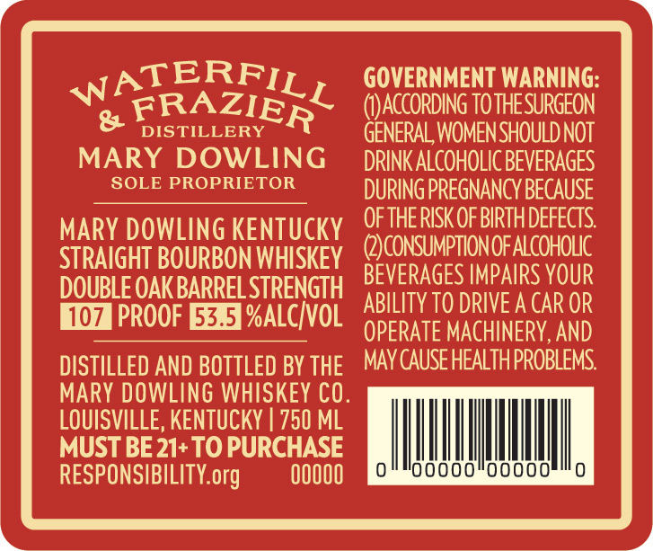
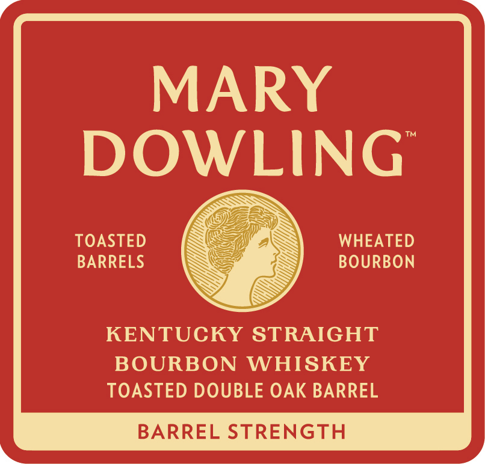
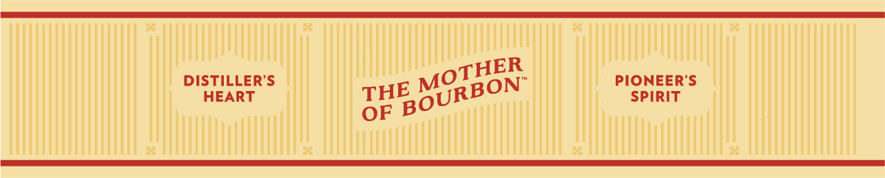

# TTB COLA Label Images - TTBID 26006001000313

**Brand Name:** MARY DOWLING

**Fanciful Name:** DOUBLE OAK

**Issue Date:** 01/07/2026

**Origin Code:** 22

**Product Class/Type:** 101

**Source:** [TTB Public COLA Registry](https://ttbonline.gov/colasonline/viewColaDetails.do?action=publicFormDisplay&ttbid=26006001000313)

## Label Images

### Back Label

### Front Label

### Label 2

## Extracted Label Text

*Text extracted via OCR - may contain errors*

*1 image(s) excluded: text did not meet readability threshold*

### Back Label

TERF]

GOVERNMENT WARNING:

w

xt

(I)ACCORDING TO THE SURGEON

&

FRAZIE

DISTILLERY

R

GENERAL WOMEN SHOULD NOT

MARY DOWLING

DRINK ALCOHOLIC BEVERAGES

SOLE PROPRIETOR

DURING PREGNANCY BECAUSE

OF THE RISK OF BIRTH DEFECTS

MARY DOWLING KENTUCKY

STRAIGHT BOURBON WHISKEY

(2)CONSUMPTION OF ALCOHOLIC

DOUBLE OAK BARREL STRENGTH

BEVERAGES IMPAIRS YOUR

HIGH PROOF E&I %ALC/VOL

ABILITY TO DRIVE A CAR OR

OPERATE MACHINERY, AND

DISTILLED AND BOTTLED BY THE

MAY CAUSE HEALTH PROBLEMS.

MARY DOWLING WHISKEY CO

LOUISVILLE, KENTUCKY | 750 ML

MUST BE 21+ TO PURCHASE

|

|

|

ll

|

i

RESPONSIBILITY.org

00000

‘00000

00000

### Front Label

MARY

DOWLING

TOASTED

WHEATED

BARRELS

BOURBON

KENTUCKY STRAIGHT

BOURBON WHISKEY

TOASTED DOUBLE OAK BARREL

BARREL STRENGTH
