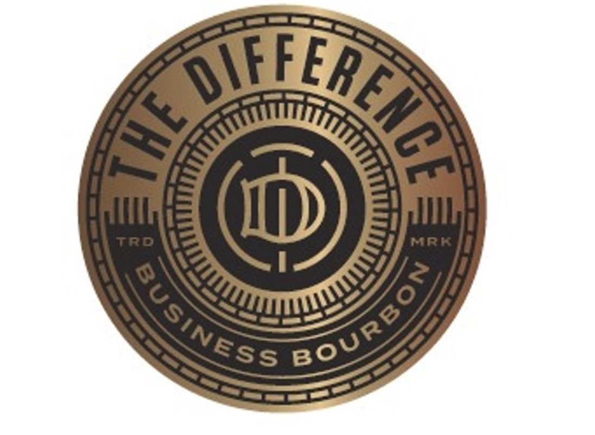
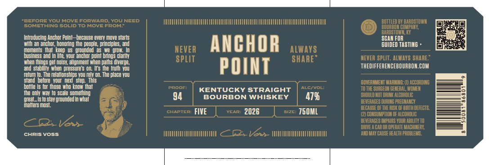

# TTB COLA Label Images - TTBID 26006001000640

**Brand Name:** THE DIFFERENCE

**Issue Date:** 01/07/2026

**Origin Code:** 22

**Product Class/Type:** 101

**Source:** [TTB Public COLA Registry](https://ttbonline.gov/colasonline/viewColaDetails.do?action=publicFormDisplay&ttbid=26006001000640)

## Label Images

### Back Label

### Front Label

### Label 3

## Extracted Label Text

*Text extracted via OCR - may contain errors*

*2 image(s) excluded: text did not meet readability threshold*

### Front Label

Introducing Anchor Plnt—-because every nave stats
wi an anchor, honoring the peaple, principles, and
moments that keen us grounded 2s we grow. In
business and nie, your anchor pont brings clay
when things get nosy, alignment when paths diverge,
and stably when pressure’s on. Ir the truth you
Tetum i. The relationships you rely on. The place you
stand before your next step. This

bottie ts for these wha know that

the only way ta scale something
‘yeal1s to stay grounded in what

imaters mos.

cHRIs voss

ANCHOR
POINT

KENTUCKY STRAIGHT
94 BOURBON WHISKEY | 47%

FIVE 2026 750ML

SCAN FOR
GUIDED TASTING +

THEDIFFERENCEBOURBON.COM
