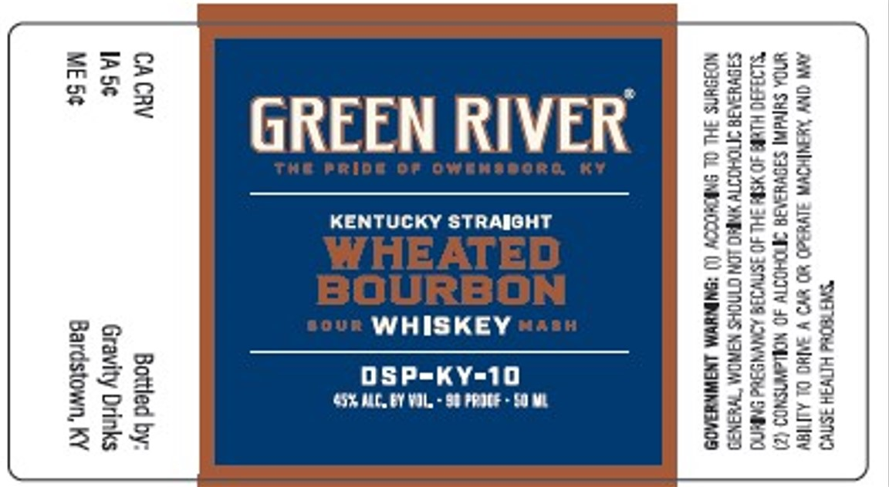

# TTB COLA Label Images - TTBID 26006001000768

**Brand Name:** GREEN RIVER

**Issue Date:** 01/08/2026

**Origin Code:** 22

**Product Class/Type:** 101

**Source:** [TTB Public COLA Registry](https://ttbonline.gov/colasonline/viewColaDetails.do?action=publicFormDisplay&ttbid=26006001000768)

## Label Images

### Label 1

## Extracted Label Text

*Text extracted via OCR - may contain errors*

### Label 1

~

“

=

=

=

2

”

a

>

GREEN RIVER

KENTUCKY STRAIGHT

o

oS

“>

5

WHEATED

=

Z

BOURBON

sous WHISKEY «©:

a

oS

OSP=KY=-10

65% MAC, BY VOL. - SB PRICE - $0 ME

~]

=

44

Ss

a]

RG

Bs

OS
