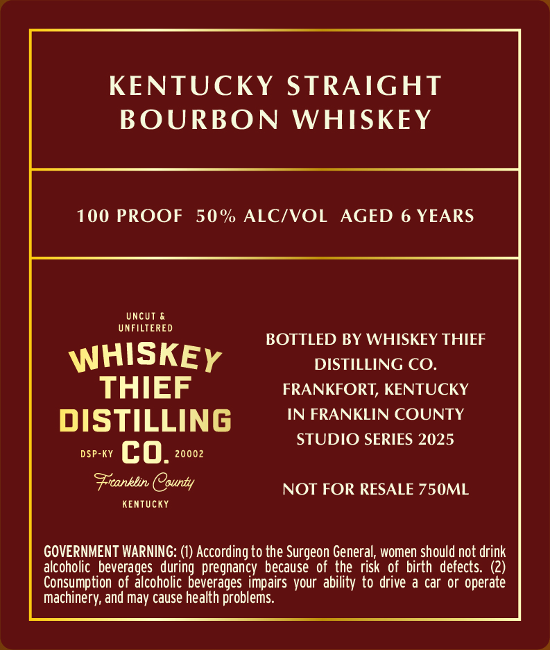
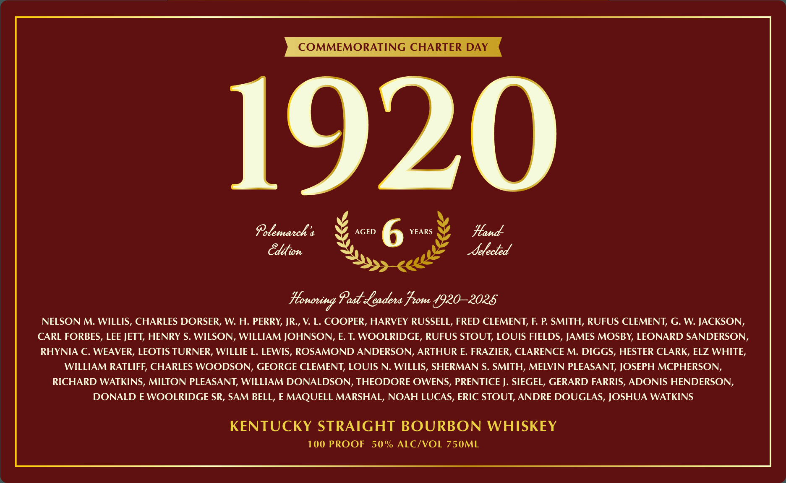

# TTB COLA Label Images - TTBID 26007001000067

**Brand Name:** WHISKEY THIEF DISTILLING CO.

**Fanciful Name:** 1920

**Issue Date:** 01/14/2026

**Origin Code:** 22

**Product Class/Type:** 101

**Source:** [TTB Public COLA Registry](https://ttbonline.gov/colasonline/viewColaDetails.do?action=publicFormDisplay&ttbid=26007001000067)

## Label Images

### Back Label

### Front Label

## Extracted Label Text

*Text extracted via OCR - may contain errors*

### Back Label

KENTUCKY STRAIGHT
BOURBON WHISKEY

100 PROOF 50% ALC/VOL AGED 6 YEARS

UNCUT &
UNFILTERED

BOTTLED BY WHISKEY THIEF
WHISKEy DISTILLING CO.

THIEF FRANKFORT, KENTUCKY

DISTILLING IN FRANKLIN COUNTY

STUDIO SERIES 2025
DSP-KY CO. 20002

Franklin (County NOT FOR RESALE 750ML

KENTUCKY

GOVERNMENT WARNING: (1) According to the Surgeon General, women should not drink
alcoholic beverages during pregnancy because of the risk of birth defects. (2)
Consumption of alcoholic beverages impairs your ability to drive a car or operate
Machinery, and may cause health problems.

### Front Label

COMMEMORATING CHARTER DAY
Pelemarch s AGED 6 YEARS Hand
Honoring Past Leaders From L9RO-2ORS
NELSON M. WILLIS, CHARLES DORSER, W. H. PERRY, JR., V. L. COOPER, HARVEY RUSSELL, FRED CLEMENT, F. P. SMITH, RUFUS CLEMENT, G. W. JACKSON,
CARL FORBES, LEE JETT, HENRY S. WILSON, WILLIAM JOHNSON, E. T. WOOLRIDGE, RUFUS STOUT, LOUIS FIELDS, JAMES MOSBY, LEONARD SANDERSON,
RHYNIA C. WEAVER, LEOTIS TURNER, WILLIE L. LEWIS, ROSAMOND ANDERSON, ARTHUR E. FRAZIER, CLARENCE M. DIGGS, HESTER CLARK, ELZ WHITE,
WILLIAM RATLIFF, CHARLES WOODSON, GEORGE CLEMENT, LOUIS N. WILLIS, SHERMAN S. SMITH, MELVIN PLEASANT, JOSEPH MCPHERSON,
RICHARD WATKINS, MILTON PLEASANT, WILLIAM DONALDSON, THEODORE OWENS, PRENTICE J. SIEGEL, GERARD FARRIS, ADONIS HENDERSON,
DONALD E WOOLRIDGE SR, SAM BELL, EMAQUELL MARSHAL, NOAH LUCAS, ERIC STOUT, ANDRE DOUGLAS, JOSHUA WATKINS
KENTUCKY STRAIGHT BOURBON WHISKEY
100 PROOF 50% ALC/VOL 750ML
