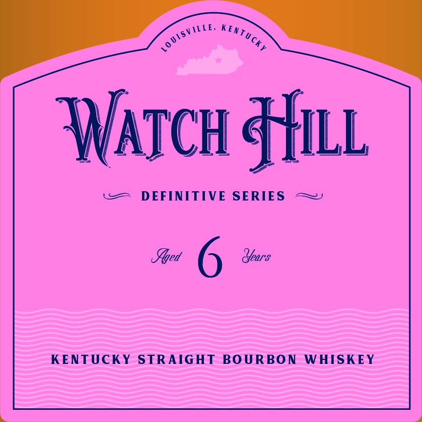
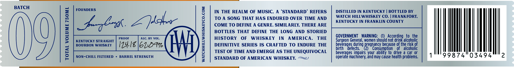

# TTB COLA Label Images - TTBID 26007001000068

**Brand Name:** WATCH HILL

**Fanciful Name:** DEFINITIVE SERIES

**Issue Date:** 01/13/2026

**Origin Code:** 22

**Product Class/Type:** 101

**Source:** [TTB Public COLA Registry](https://ttbonline.gov/colasonline/viewColaDetails.do?action=publicFormDisplay&ttbid=26007001000068)

## Label Images

### Front Label

### Label 2

## Extracted Label Text

*Text extracted via OCR - may contain errors*

### Front Label

i

SL

ATCH sf

co

DEFINITIVE SERIES ~~

Set 6 Sar

KENTUCKY STRAIGHT BOURBON WHISKEY

### Label 2

BATCH

FOUNDERS

IN THE REALM OF MUSIC, A ‘STANDARD’ REFERS

DISTILLED IN KENTUCKY | BOTTLED BY

TO A SONG THAT HAS ENDURED OVER TIME AND

WATCH HILLWHISKEY CO. | FRANKFORT,

KENTUCKY IN FRANKLIN COUNTY

COME TO DEFINE A GENRE. SIMILARLY, THERE ARE

Aaghrth. Z poher

BOTTLES THAT DEFINE THE LONG AND STORIED

PROOF

ALC. BY VOL.

HISTORY OF WHISKEY IN AMERICA. THE

GOVERNMENT WARNING: (1) According to the

KENTUCKY STRAIGHT

Surgeon General, women should not drink alcoholic

BOURBON WHISKEY

[24.18 |6209%

DEFINITIVE SERIES IS CRAFTED TO ENDURE THE

birth defects.

beverages during pregnancy because of the risk

TEST OF TIME AND EMERGE AS THE UNEQUIVOCAL

.

2) Consumption of alcoholic

NON-CHILL FILTERED + BARREL STRENGTH

operate machinery, and may cause health problems.

beverages impairs your ability to drive a car or

{INT

(9

STANDARD OF AMERICAN WHISKEY. =~
