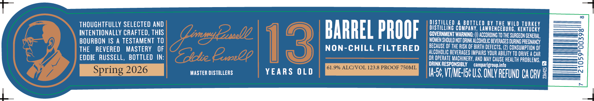
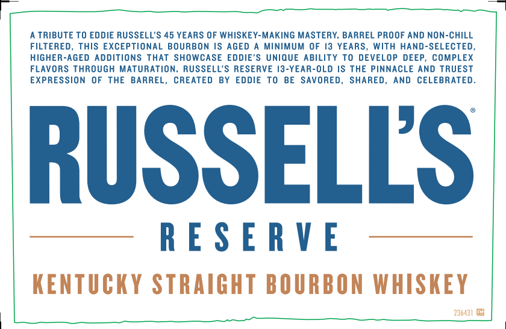
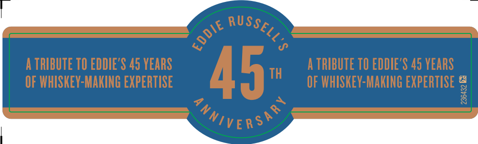

# TTB COLA Label Images - TTBID 26007001000473

**Brand Name:** RUSSELL'S RESERVE

**Fanciful Name:** 13 YEARS OLD

**Issue Date:** 01/09/2026

**Origin Code:** 22

**Product Class/Type:** 101

**Source:** [TTB Public COLA Registry](https://ttbonline.gov/colasonline/viewColaDetails.do?action=publicFormDisplay&ttbid=26007001000473)

## Label Images

### Label 1

### Label 2

### Label 3

## Extracted Label Text

*Text extracted via OCR - may contain errors*

*1 image(s) excluded: text did not meet readability threshold*

### Label 1

THOUGHTFULLY SELECTED AND
INTENTIONALLY CRAFTED, THIS
BOURBON IS A TESTAMENT TO
THE REVERED MASTERY OF
EDDIE RUSSELL, BOTTLED IN:

MASTER DISTILLERS

BARREL PROOF

NON-CHILL FILTERED

YEARS OLD

DISTILLED & BOTTLED BY THE WILD TURKEY
DISTILLING COMPANY, LAWRENCEBURG, KENTUCKY
GOVERNMENT WARNING: () ACCORDING TO THE SURGEON GENERAL,
(WOMEN SHOULD NOT DRINK ALCOHOLIC BEVERAGES DURING PREGNANCY
‘BECAUSE OF THE RISK OF BIRTH DEFECTS. (2) CONSUMPTION OF
ALCOHOLIC BEVERAGES IMPAIRS YOUR ABILITY TO DRIVE A CAR
OR OPERATE MACHINERY, AND MAY CAUSE HEALTH PROBLEMS,
DRINK RESPONSIBLY — camparigroup in

Ue, VME US ONLY REFUND CACRY

### Label 2

A TRIBUTE TO EDDIE RUSSELL’S 45 YEARS OF WHISKEY-MAKING MASTERY, BARREL PROOF AND NON-CHILL

FILTERED, THIS EXCEPTIONAL BOURBON IS AGED A MINIMUM OF I3 YEARS, WITH HAND-SELECTED,

HIGHER-AGED ADDITIONS THAT SHOWCASE EDDIE'S UNIQUE ABILITY TO DEVELOP DEEP, COMPLEX

FLAVORS THROUGH MATURATION, RUSSELL’S RESERVE 13-YEAR-OLD IS THE PINNACLE AND TRUEST

EXPRESSION OF THE BARREL, CREATED BY EDDIE TO BE SAVORED, SHARED, AND CELEBRATED

RUSSELLS

RESERVE

KENTUCKY STRAIGHT BOURBON WHISKEY

236431 OE
