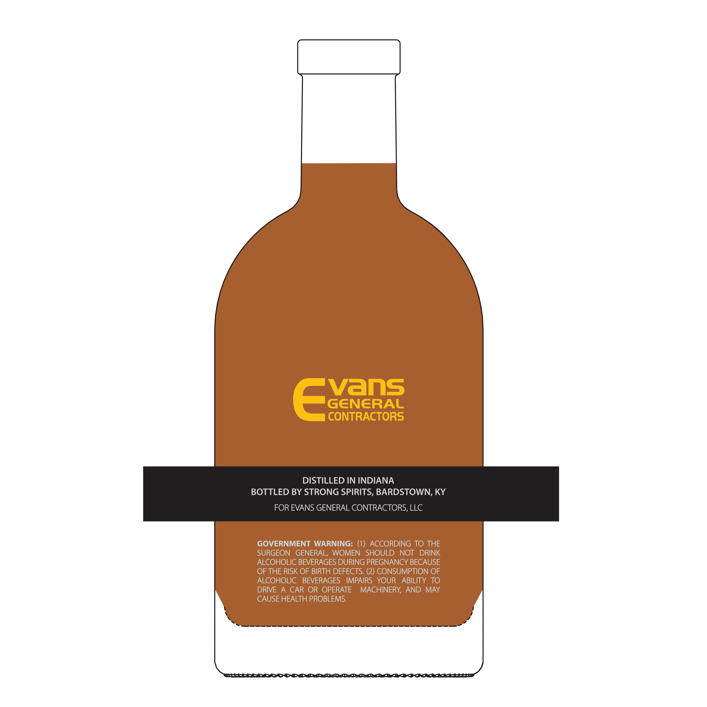
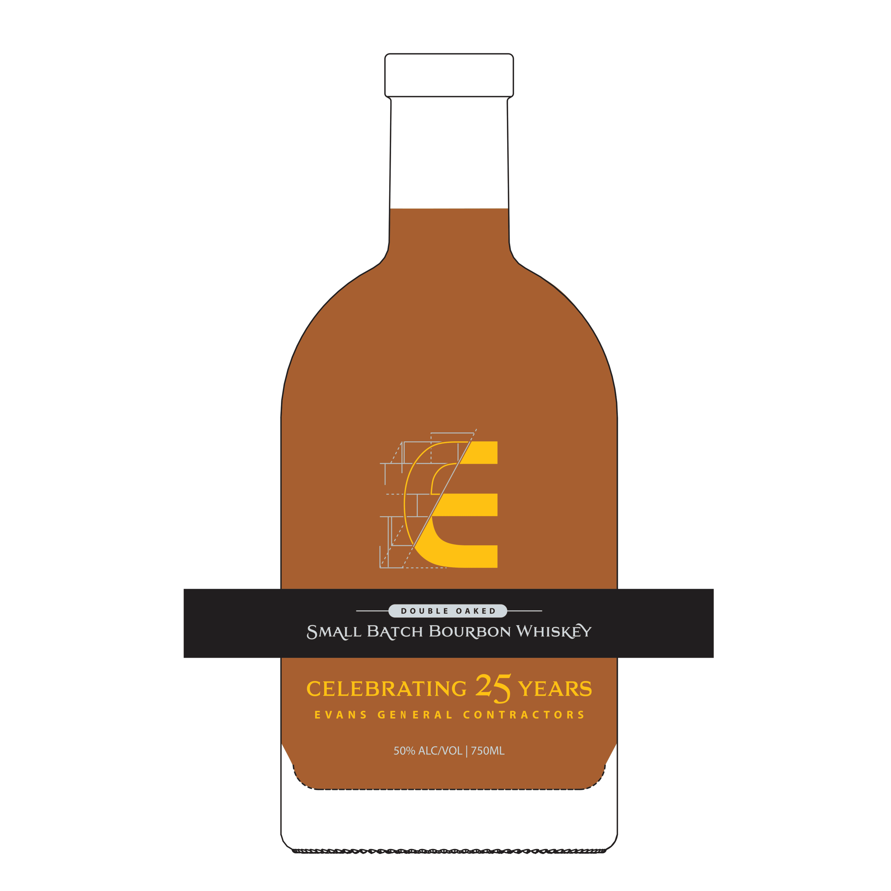

# TTB COLA Label Images - TTBID 26007001000494

**Brand Name:** EVANS GENERAL CONTRACTORS

**Fanciful Name:** DOUBLE OAKED

**Issue Date:** 01/08/2026

**Origin Code:** 22

**Product Class/Type:** 141

**Source:** [TTB Public COLA Registry](https://ttbonline.gov/colasonline/viewColaDetails.do?action=publicFormDisplay&ttbid=26007001000494)

## Label Images

### Back Label

### Front Label

## Extracted Label Text

*Text extracted via OCR - may contain errors*

### Back Label

Vans

GENERAL

CONTRACTORS

DISTILLED IN INDIANA

BOTTLED BY STRONG SPIRITS, BARDSTOWN, KY

FOR EVANS GENERAL CONTRACTORS, LLC

GOVERNMENT WARNING: (1) ACCORDING TO THE

SURGEON GENERAL, WOMEN SHOULD NOT DRINK

ALCOHOLIC BEVERAGES DURING PREGNANCY BECAUSE

OF THE RISK OF BIRTH DEFECTS. (2) CONSUMPTION OF

ALCOHOLIC BEVERAGES IMPAIRS YOUR ABILITY TO

DRIVE A CAR OR OPERATE MACHINERY, AND MAY

CAUSE HEALTH PROBLEMS.

~~ SS = ©]. eS |S » » - » Vd 4

ll - ell ww w wv FH A AM MK

### Front Label

=

de

ee ee ee

SMALL BATCH BOURBON WHISKEY

CELEBRATING 245 YEARS

EVANS GENERAL CONTRACTORS

50% ALC/VOL | 750ML

_—~S. SS. => & &

Se ee
