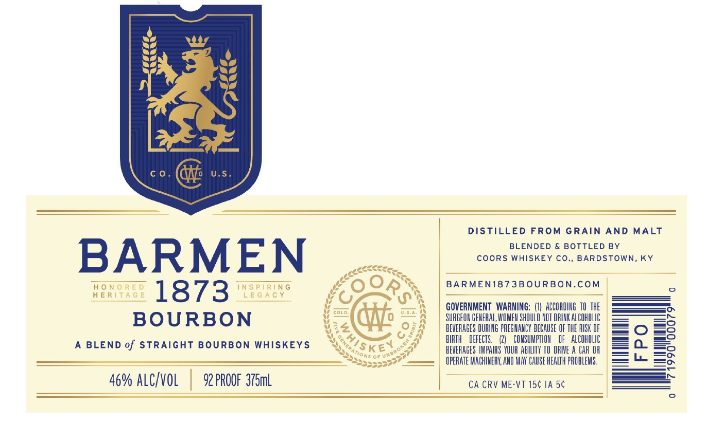

# TTB COLA Label Images - TTBID 26007001000557

**Brand Name:** BARMEN 1873

**Issue Date:** 01/08/2026

**Origin Code:** 22

**Product Class/Type:** 121

**Source:** [TTB Public COLA Registry](https://ttbonline.gov/colasonline/viewColaDetails.do?action=publicFormDisplay&ttbid=26007001000557)

## Label Images

### Label 1

### Label 2

## Extracted Label Text

*Text extracted via OCR - may contain errors*

*1 image(s) excluded: text did not meet readability threshold*

### Label 1

J

DISTILLED FROM GRAIN AND MALT

BLENDED & BOTTLED BY

COORS WHISKEY CO., BARDSTOWN, KY

BARMEN

DS

AeeReee

To,

HONORED

INSPIRING

04

BARMEN1873BOURBON.COM

HERITAGE

LEGACY

tg

as

1873 tea

V4

uv

i core.

i.

SURGEON GENERAL WOMEN SHOULD NOT DRINK ALCOHOLIC

GOVERNMENT WARNING: (1) ACCORDING 10 THE

BOURBON

Vo

hea

4

ay

yi

en

BEVERAGES DURING PREGHANCY BECAUSE OF THE RISK OF

A BLEND of STRAIGHT BOURBON WHISKEYS

Se

BIATH DEFECTS. (2) CONSUMPTION OF ALCOKOLIC

Sse 7ons of Une

KEN

BEVERAGES IMPAIRS YOUR ABILITY TO DRIVE A CAR OR

rere

OPERATE MACHINERY, AND MAY CAUSE HEALTH PROBLEMS.

———

6% ALC/VOL | 92 PROOF 376ml

CA CRV ME-VT 15¢ IA 5¢
