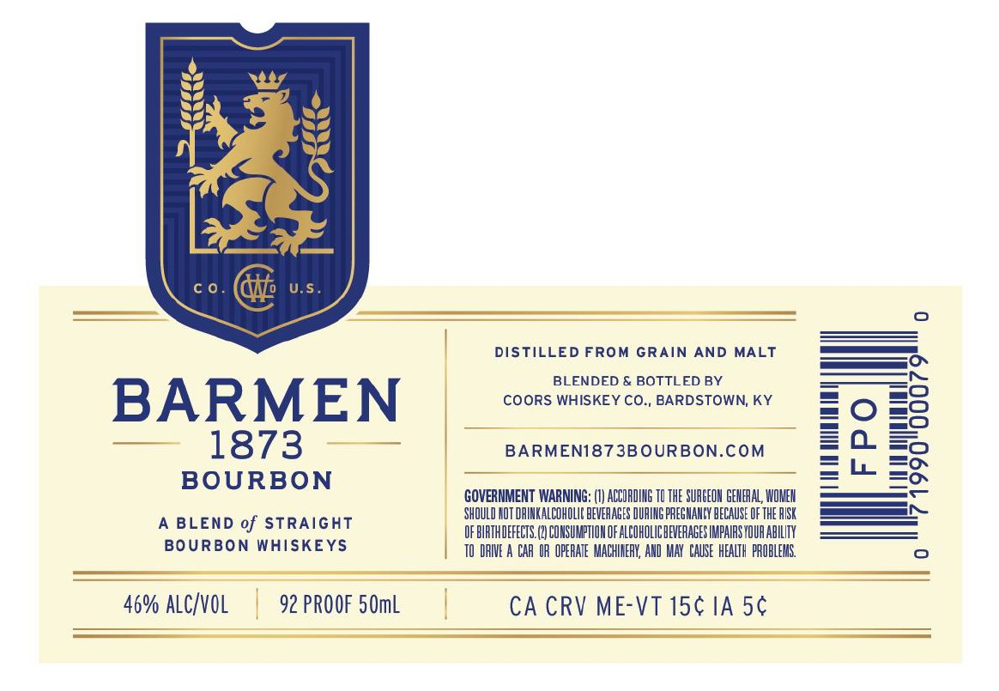

# TTB COLA Label Images - TTBID 26007001000566

**Brand Name:** BARMEN 1873

**Issue Date:** 01/08/2026

**Origin Code:** 22

**Product Class/Type:** 121

**Source:** [TTB Public COLA Registry](https://ttbonline.gov/colasonline/viewColaDetails.do?action=publicFormDisplay&ttbid=26007001000566)

## Label Images

### Label 1

## Extracted Label Text

*Text extracted via OCR - may contain errors*

### Label 1

1

DISTILLED FROM GRAIN AND MALT

———

BLENDED & BOTTLED BY

COORS WHISKEY CO., BARDSTOWN, KY

BARMEN

—_—_ s/o

BARMEN1873BOURBON.COM

BOURBON

GOVERNMENT WARNING: (1) ACCORDING T0 THE SURGEON GENERAL, WONEN

ae

‘SHOULD NOT DRINKALCOWOLIC BEVERAGES DURING PREGNANCY BECAUSE OF THE RISK

—

A BLEND of STRAIGHT

OFBIRTHOEFECTS.(2) CONSUMPTION OF ALCOHOLIC BEVERAGES IMPAIRS YOUR ABILITY

BOURBON WHISKEYS

TO DRIVE A CAR OR OPERATE MACHINERY, AND MAY CAUSE HEALTH PROBLEMS.

46% ALCIVOL | 92 PROOF SOmL

|

CA CRV ME-VT 15¢ IA 5¢
