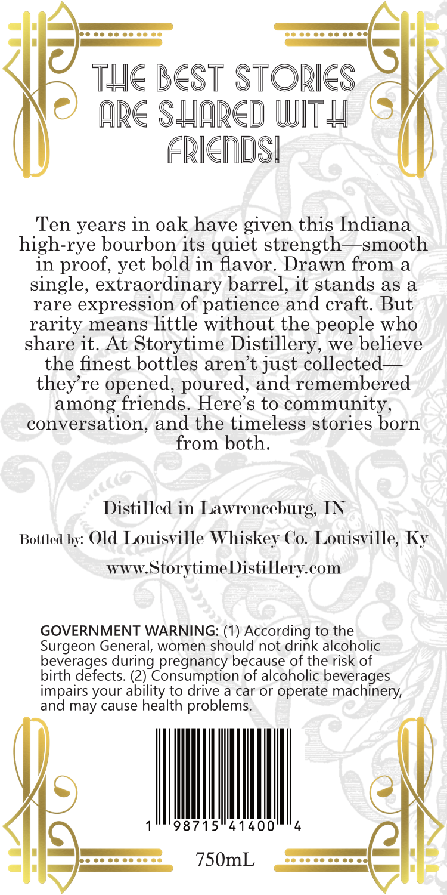
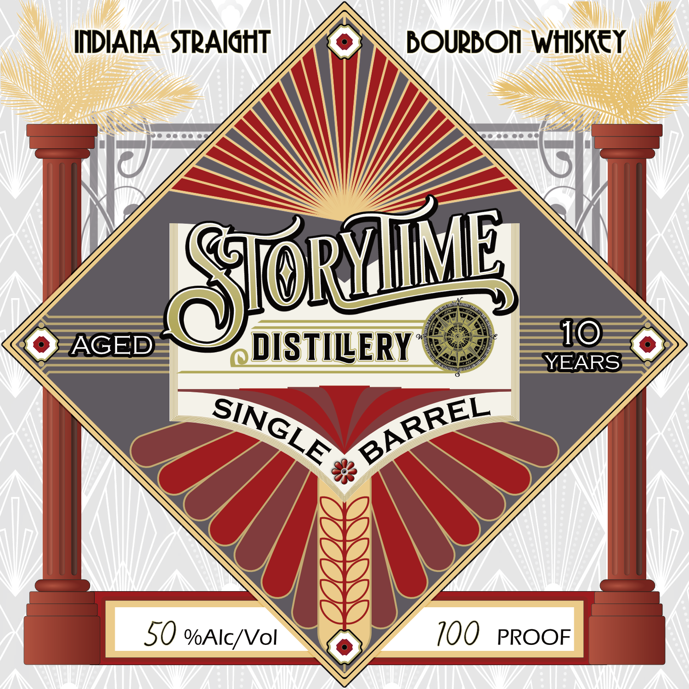

# TTB COLA Label Images - TTBID 26007001000655

**Brand Name:** STORY TIME

**Issue Date:** 01/08/2026

**Origin Code:** 22

**Product Class/Type:** 141

**Source:** [TTB Public COLA Registry](https://ttbonline.gov/colasonline/viewColaDetails.do?action=publicFormDisplay&ttbid=26007001000655)

## Label Images

### Back Label

### Label 1

## Extracted Label Text

*Text extracted via OCR - may contain errors*

### Back Label

OTe EEE

ee 00 00 ce cee

=

THE BEST STORIES

ARE SHARD WITH

FRIENDS!

Ten years in oak have given this Indiana

high-rye bourbon its quiet strength—smooth

in proof, yet bold in flavor. Drawn from a

single, extraordinary barrel, it stands as a

rare expression of patience and craft. But

rarity means little without the people who

share it. At Storytime Distillery, we believe

the finest bottles aren’t just collected—

they're opened, poured, and remembered

among friends. Here’s to community,

conversation, and the timeless stories born

from both.

Distilled in Lawrenceburg, IN

Bottled by: Old Louisville Whiskey Co. Louisville, Ky

www.StorytimeDistillery.com

GOVERNMENT WARNING: (1) According to the

Surgeon General, women should not drink alcoholic

beverages during pregnancy because of the risk of

birth defects. (2) Consumption of alcoholic beverages

impairs your ability to drive a car or operate machinery,

and may cause health problems.

4

98715541400

|

=

=

@

7)

poo

750mL

— ee cc cee

—i

|

### Label 1

AM

O

Gi

DISTILERY %

\i IM

Tin

=O

Lé

d
