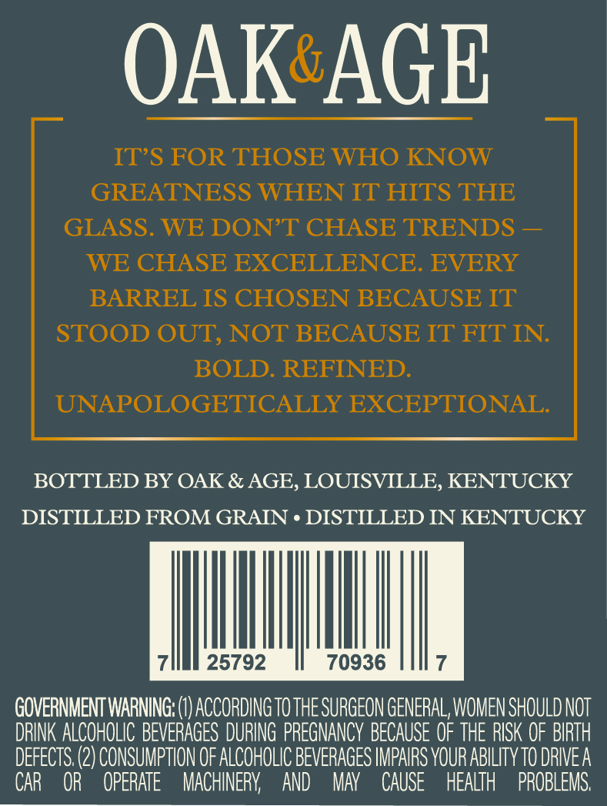
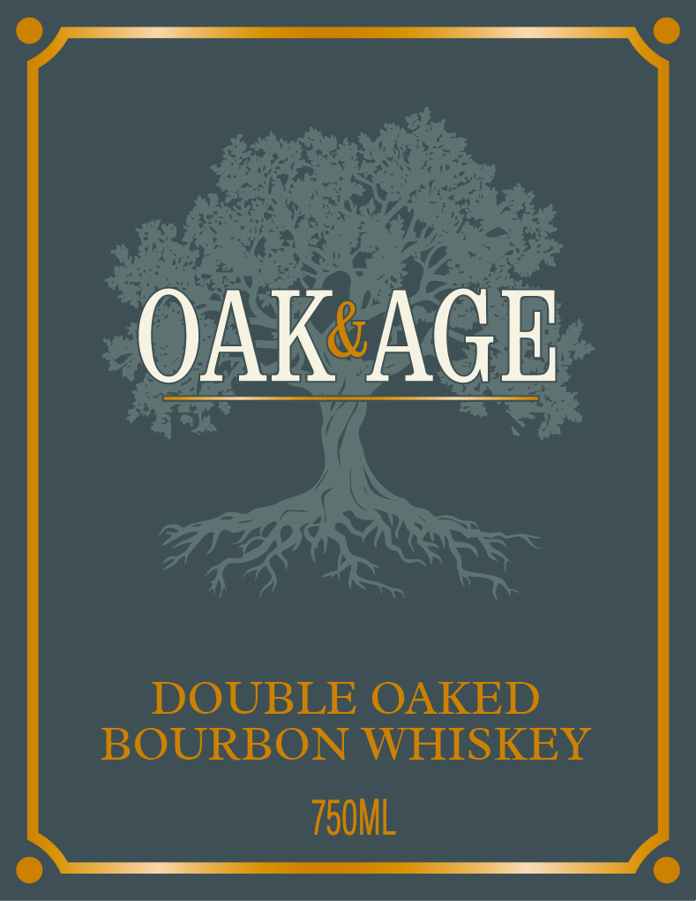
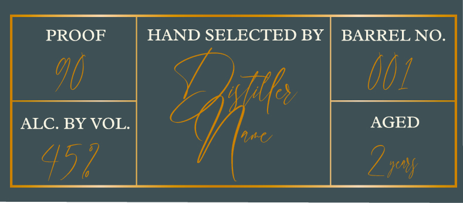

# TTB COLA Label Images - TTBID 26007001000680

**Brand Name:** OAK & AGE

**Issue Date:** 01/08/2026

**Origin Code:** 22

**Product Class/Type:** 141

**Source:** [TTB Public COLA Registry](https://ttbonline.gov/colasonline/viewColaDetails.do?action=publicFormDisplay&ttbid=26007001000680)

## Label Images

### Back Label

### Front Label

### Label 3

## Extracted Label Text

*Text extracted via OCR - may contain errors*

### Back Label

OAK’ AGE

IT’S FOR THOSE WHO KNOW

GREATNESS WHEN IT HITS THE

GLASS. WE DON’T CHASE TRENDS —

WE CHASE EXCELLENCE. EVERY

BARREL IS CHOSEN BECAUSE IT

STOOD OUT, NOT BECAUSE IT FIT IN.

BOLD. REFINED.

UNAPOLOGETICALLY EXCEPTIONAL.

BOTTLED BY OAK & AGE, LOUISVILLE, KENTUCKY

DISTILLED FROM GRAIN ¢ DISTILLED IN KENTUCKY

7

25792

70936

7

GOVERNMENT WARNING: (I) ACCORDING T0 THE SURGEON GENERAL WOMEN SHOULD NOT

DRINK ALCOHOLIC BEVERAGES DURING PREGNANCY BECAUSE OF THE RISK OF BIRTH

DEFECTS. (2) CONSUMPTION OF ALCOHOLIC BEVERAGES IMPAIRS YOUR ABILITY T0 DRIVE A

CAR OR OPERATE MACHINERY, AND MAY CAUSE HEALTH PROBLEMS.

### Front Label

OAK AGE

DOUBLE OAKED

BOURBON WHISKEY

750ML

### Label 3

PROOF

HAND SELECTED BY | BARREL NO

1)

Up!

ALC. BY VOL.

AGED

UL

Vk

7 1M
