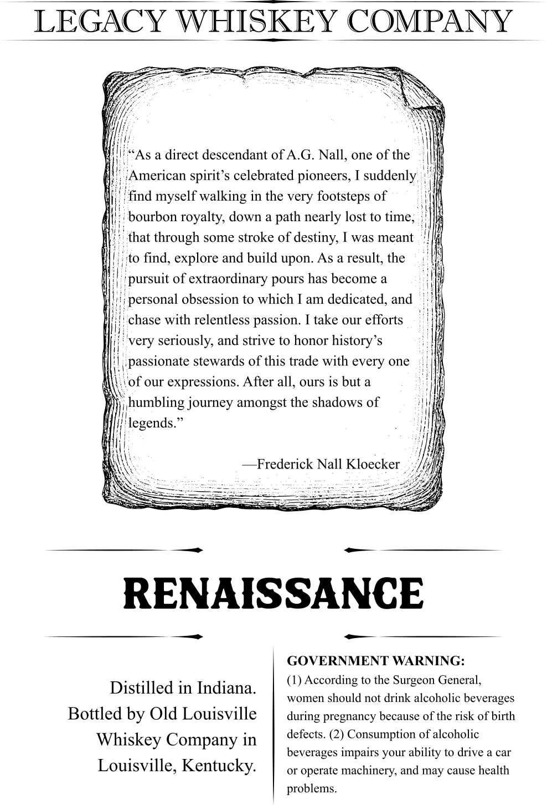
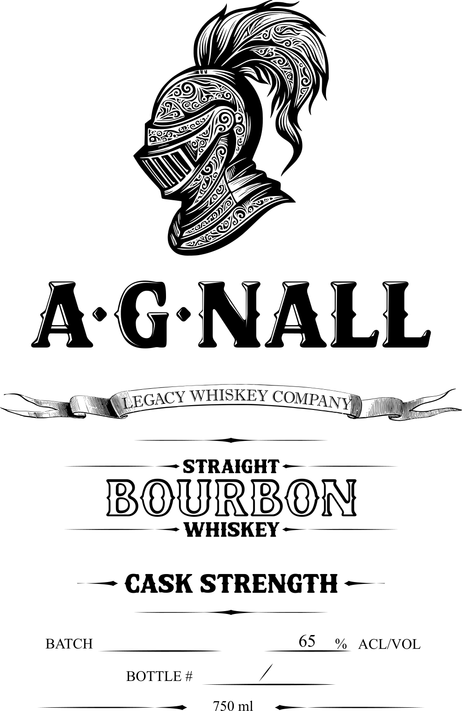

# TTB COLA Label Images - TTBID 26007001000706

**Brand Name:** A.G NALL'S

**Issue Date:** 01/08/2026

**Origin Code:** 22

**Product Class/Type:** 101

**Source:** [TTB Public COLA Registry](https://ttbonline.gov/colasonline/viewColaDetails.do?action=publicFormDisplay&ttbid=26007001000706)

## Label Images

### Back Label

### Front Label

## Extracted Label Text

*Text extracted via OCR - may contain errors*

*1 image(s) excluded: text did not meet readability threshold*

### Back Label

LEGACY WHISKEY COMPANY

a

KZ

is)

Hi)

iy

“As a direct descendant of A.G. Nall, one of the

Ny

merican spirit’s celebrated pioneers, I suddenly ;

find myself walking in the very footsteps of

Hi

4

bourbon royalty, down a path nearly lost to time,

that through some stroke of destiny, I was meant

i

to find, explore and build upon. As a result, the

pursuit of extraordinary pours has become a

personal obsession to which I am dedicated, and

{ud

hase with relentless passion. I take our efforts

4h

i

very seriously, and strive to honor history’s

| ‘| passionate stewards of this trade with every one

‘i

A \.of our expressions. After all, ours is but a

; humbling journey amongst the shadows of

Mt

{|

f

i legends.”

Ir

—Frederick Nall Kloecker

—

RENAISSANCE

—

GOVERNMENT WARNING:

Distilled in Indiana.

(1) According to the Surgeon General,

women should not drink alcoholic beverages

Bottled by Old Louisville

during pregnancy because of the risk of birth

defects. (2) Consumption of alcoholic

Whiskey Company in

beverages impairs your ability to drive a car

Louisville, Kentucky.

or operate machinery, and may cause health

problems.
