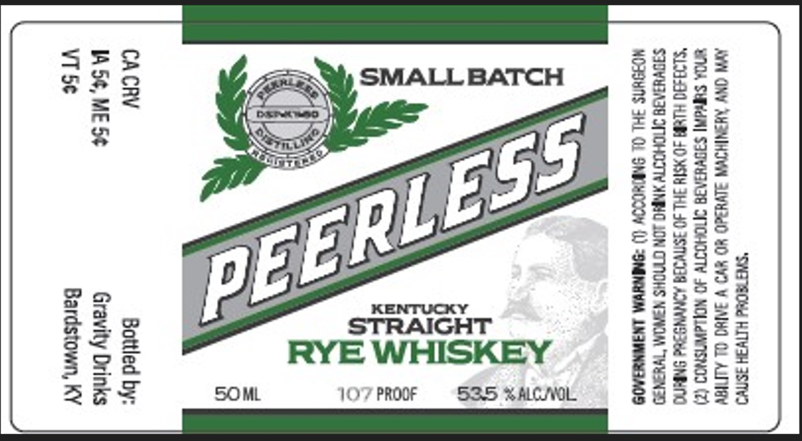

# TTB COLA Label Images - TTBID 26007001000727

**Brand Name:** PEERLESS

**Issue Date:** 01/08/2026

**Origin Code:** 22

**Product Class/Type:** 102

**Source:** [TTB Public COLA Registry](https://ttbonline.gov/colasonline/viewColaDetails.do?action=publicFormDisplay&ttbid=26007001000727)

## Label Images

### Label 1

## Extracted Label Text

*Text extracted via OCR - may contain errors*

### Label 1

aoa

A=

SMALL BATCH

243s

"“=z2

Siae

4—

= o>

eee

"

oS

==

swz

“=

ET,

5

==

EP Et.

g&

gc

ae

[E2

S28

#3

Ss

sex

2s

45

pe

KENTUCKY

G=

az

STRAIGHT

SSSR EE

RYE WHISKEY

=o

#320

as

Sew

BEE

SO ML

}O'7 PROOF S35 S ALCL

we

a3

=F
