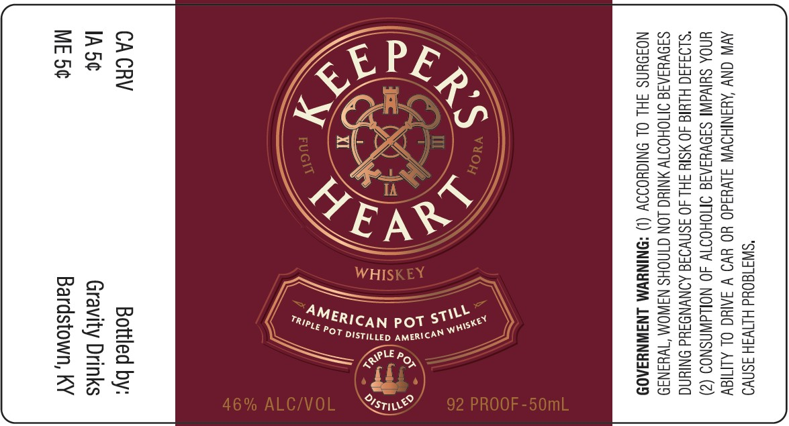

# TTB COLA Label Images - TTBID 26007001000739

**Brand Name:** KEEPER'S HEART

**Issue Date:** 01/09/2026

**Origin Code:** 22

**Product Class/Type:** 140

**Source:** [TTB Public COLA Registry](https://ttbonline.gov/colasonline/viewColaDetails.do?action=publicFormDisplay&ttbid=26007001000739)

## Label Images

### Label 1

## Extracted Label Text

*Text extracted via OCR - may contain errors*

### Label 1

"SWI180Ud HINWSH ASO
AVIN CNV AYANIHOWW SLVH3ad0 YO YVO V SAIC OL ALMIGY
UNOA SUIVAINI SIOVYIAIG IMOHOTT 40 NOLLdWASNOD (2)

“SLOS43G HLYI 40 MSIY SH 40 SSNVOSE AONVNDAd ONIYNG
SIOVYSAIS ONOHOTT ANIUG LON CINOHS NAWOM “IWYINI9
NOJOUNS JHL OL ONIGHOIOY (1) *ONINYWM LNAWNYIA0D

sri

<i
= (On

x
Ke
isl
POT DistiLeD AMERICAN ©

—

I
4 \
Trin tERICAN Pot ST

Bottled by:
Gravity Drinks

Bardstown, KY
