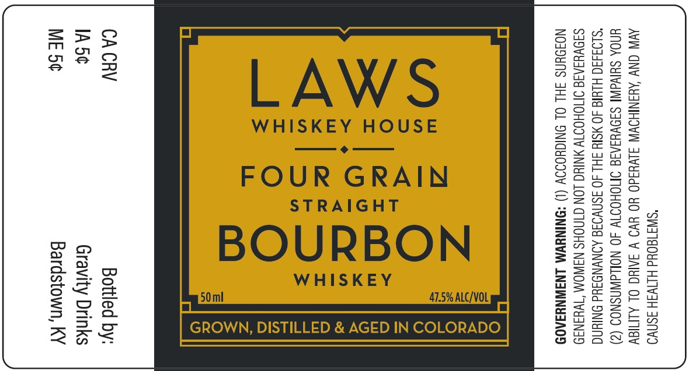

# TTB COLA Label Images - TTBID 26007001000742

**Brand Name:** LAWS WHISKEY HOUSE

**Issue Date:** 01/09/2026

**Origin Code:** 22

**Product Class/Type:** 101

**Source:** [TTB Public COLA Registry](https://ttbonline.gov/colasonline/viewColaDetails.do?action=publicFormDisplay&ttbid=26007001000742)

## Label Images

### Label 1

## Extracted Label Text

*Text extracted via OCR - may contain errors*

### Label 1

"SWI180Ud HINWSH ASAD
AVIN CNY AUANIHOWW SLV¥3d0 YO YVO V SAIC OL ALMIGY
UNOA SUIVAINT SIOVYIAIG IMOHOTW 40 NOLLdWNSNOS (2)
“SLO3430 HLUI 40 YSIY SH 40 ISNVOSE AONVNDAd ONIN
S39VUIAIS INOHOITW ANIC LON CINOHS NAWOM ‘TWHINI9
NOJOUNS FHL OL ONIGHOIOY (1) *QNINYWM LNAWNYSA0D

Ze
Y) O
<{£|2i5:
_I O
a

im 7
> =
= |||
Se)
& || fez
2 =)
=
= LL

GROWN, DISTILLED & AGED IN COLOR

CA CRV Bottled by:
IA5¢ Gravity Drinks
ME 5¢ Bardstown, KY
