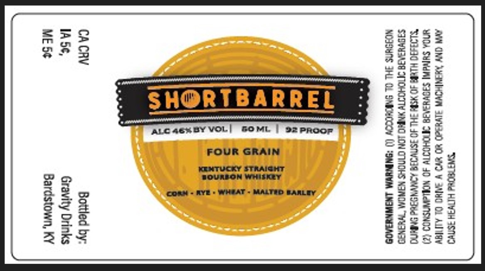

# TTB COLA Label Images - TTBID 26007001000749

**Brand Name:** SHORTBARREL

**Issue Date:** 01/08/2026

**Origin Code:** 22

**Product Class/Type:** 101

**Source:** [TTB Public COLA Registry](https://ttbonline.gov/colasonline/viewColaDetails.do?action=publicFormDisplay&ttbid=26007001000749)

## Label Images

### Label 1

## Extracted Label Text

*Text extracted via OCR - may contain errors*

### Label 1

‘SWATH HITWFH 3ST"
AYN ONY MANIHOWA SIVH3ED WO wD ¥ BAH OL AlIaY
WDA SHIVA SIQVHAAIA ANOHOTTY 40 NOMLAWISNOD (7)
“SLIRA0 HLERE 4D NSPE SHL JO ISMVIRS ADNVNSSed SMA
SIQVUSNIA ATOHOTTY YEO LON CUNOKS NANOM WHANSD
NOSIUNS FHL OL SNICHOOOY (0 *ONINYYIM LNSINNRA0S

i
a
38
A
3
3

Bottled by:
Gravity Drinks
Bardstown, KY
