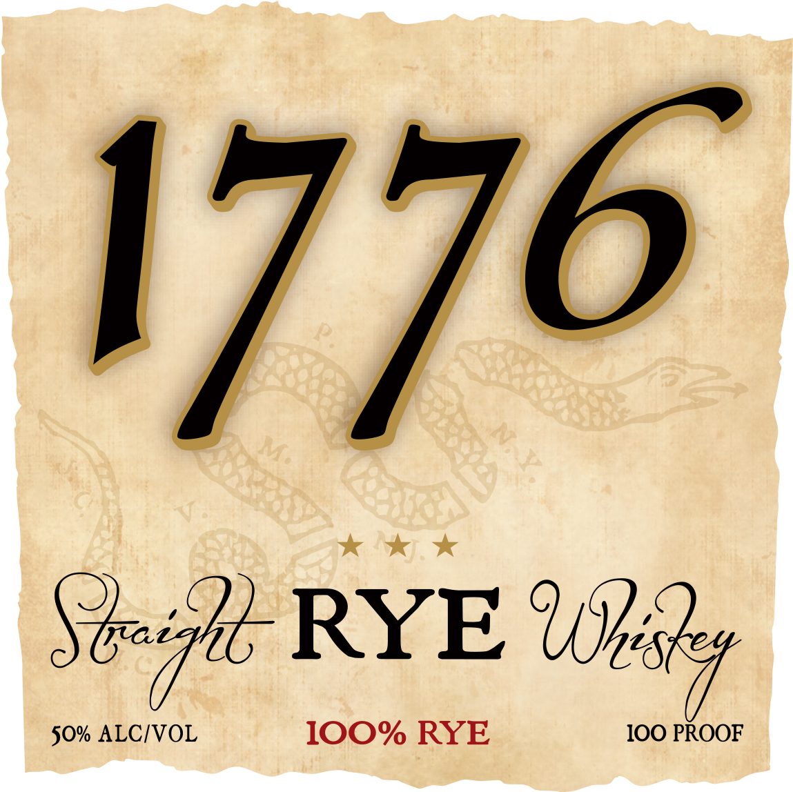
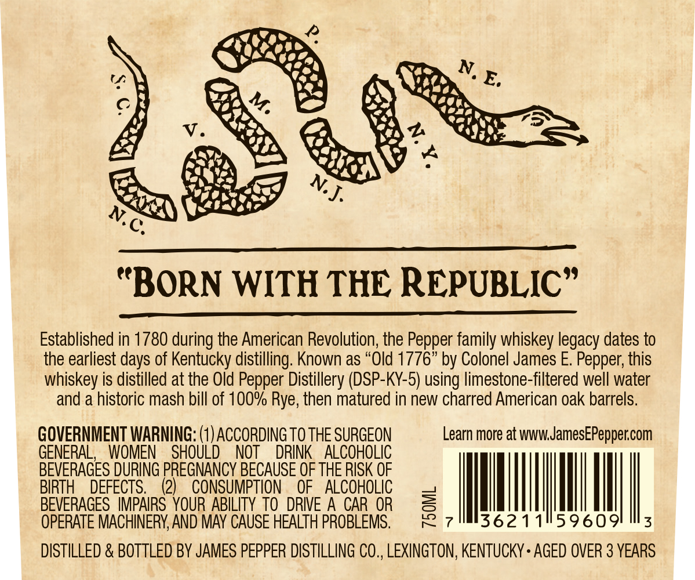

# TTB COLA Label Images - TTBID 26007001000758

**Brand Name:** 1776

**Issue Date:** 01/08/2026

**Origin Code:** 22

**Product Class/Type:** 102

**Source:** [TTB Public COLA Registry](https://ttbonline.gov/colasonline/viewColaDetails.do?action=publicFormDisplay&ttbid=26007001000758)

## Label Images

### Label 1

### Label 2

## Extracted Label Text

*Text extracted via OCR - may contain errors*

### Label 1

1776

Vig RYE uh

: PROOF

i

### Label 2

Lh

Ni

ia

AA

406.

LN

Ve)

@ay in

Pts

a0

See

(@

“BORN WITH THE REPUBLIC”

Established in 1780 during the American Revolution, the Pepper family whiskey legacy dates to

the earliest days of Kentucky distilling. Known as “Old 1776” by Colonel James E. Pepper, this

whiskey is distilled at the Old Pepper Distillery (DSP-KY-5) using limestone-filtered well water

and a historic mash bill of 100% Rye, then matured in new charred American oak barrels

GOVERNMENT WARNING: (1) ACCORDING TO THE SURGEON

Learn more at www.JamesEPepper.com

GENERAL, WOMEN SHOULD NOT DRINK ALCOHOLIC

BEVERAGES DURING PREGNANCY BECAUSE OF THE RISK OF

=i

BIRTH DEFECTS.

(2) CONSUMPTION OF ALCOHOLIC

=

BEVERAGES IMPAIRS YOUR ABILITY TO DRIVE A CAR OR

iS

|

|

36211

|

|

59609

|

|

|

OPERATE MACHINERY, AND MAY CAUSE HEALTH PROBLEMS

DISTILLED & BOTTLED BY JAMES PEPPER DISTILLING CO., LEXINGTON, KENTUCKY + AGED OVER 3 YEARS
