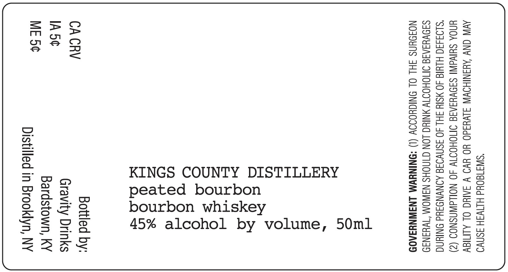

# TTB COLA Label Images - TTBID 26008001000595

**Brand Name:** KINGS COUNTY DISTILLERY

**Issue Date:** 01/22/2026

**Origin Code:** 22

**Product Class/Type:** 141

**Source:** [TTB Public COLA Registry](https://ttbonline.gov/colasonline/viewColaDetails.do?action=publicFormDisplay&ttbid=26008001000595)

## Label Images

### Label 1

## Extracted Label Text

*Text extracted via OCR - may contain errors*

### Label 1

“SWI1d0¥d HIIWSH ASNVO
AVN CNY AYANIHOWW JiVd4d0 YO YVO V JAINC OL ALNay
UYNOA SUIVdINI SINVYIAIG INOHOIW 4O NOLLAWASNOD (2)
"S104450 HLUIG 40 YSIY FHL 40 SSNVIIG AINYNOFYd ONIN
S3OVUIAIS OMOHOITV MNIUG LON CINOHS N3WOM “TWH3N39
NOJOYNS JHL OL ONIGHOIOV (1) “SNINYWM LNAIWNYSA09

fo |

&

rs
a
faa ~
sg
a a
AB Oo
wn >
H
=) DN
> Q
2389
(@) ()
a ae
ide}
S O
a is
SG =

ae
ome.
QU
Med
os
a
CTO
®@ Q
yuyu
od
ae)
QA,

Bottled by:

Gravity Drinks
Bardstown, KY

Distilled in Brooklyn, NY
