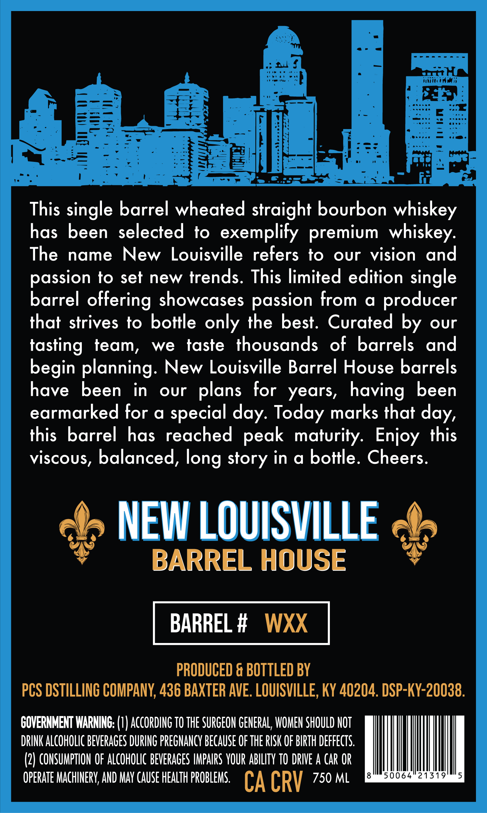
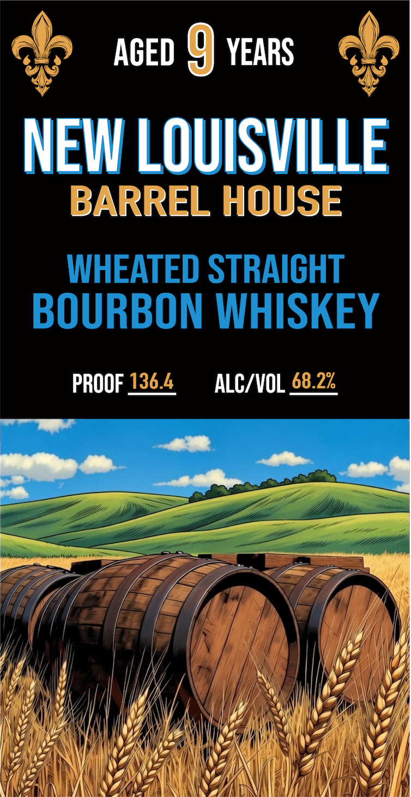

# TTB COLA Label Images - TTBID 26008001000931

**Brand Name:** NEW LOUISVILLE BARREL HOUSE

**Issue Date:** 01/09/2026

**Origin Code:** 22

**Product Class/Type:** 101

**Source:** [TTB Public COLA Registry](https://ttbonline.gov/colasonline/viewColaDetails.do?action=publicFormDisplay&ttbid=26008001000931)

## Label Images

### Back Label

### Front Label

## Extracted Label Text

*Text extracted via OCR - may contain errors*

### Back Label

This single barrel wheated straight bourbon whiskey

has been selected to exemplify premium whiskey

The name New Louisville refers to our vision and

passion to set new trends. This limited edition single

barrel offering showcases passion from a producer

that strives to bottle only the best. Curated by our

tasting team, we taste thousands of barrels and

begin planning. New Louisville Barrel House barrels

have been in our plans for years, having been

earmarked for a special day. Today marks that day,

this barrel has reached peak maturity. Enjoy this

viscous, balanced, long story in a bottle. Cheers

oo NEW LOUISVILLE oo

BARREL HOUSE

PRODUCED & BOTTLED BY

PCS DSTILLING COMPANY, 436 BAXTER AVE. LOUISVILLE, KY 40204. DSP-KY-20038

GOVERNMENT WARNING: (1) ACCORDING TO THE SURGEON GENERAL, WOMEN SHOULD NOT

DRINK ALCOHOLIC BEVERAGES DURING PREGNANCY BECAUSE OF THE RISK OF BIRTH DEFFECTS

(2) CONSUMPTION OF ALCOHOLIC BEVERAGES IMPAIRS YOUR ABILITY TO DRIVE A CAR OR

OPERATE MACHINERY, AND MAY CAUSE HEALTH PROBLEMS, C A CRY 750 ML

### Front Label

aceD 9 years

NEW

ILLE

BAR

L»

LOUISVIL

= Ee

SCE

WHEATED STRAIGHT

BOURBON WHISKEY

PROOF

ALC/VOL

ZS

Uf

MN

UN

Wy

"ff

\@Z

Hj}

Wy

{//

AZ

14

Y

/

YY

1a,

AIT

A /,

\e

(V4

WA

VAN

W\\\|

Wi

yg

We

of

A

iY)

WZ

\4

(7

RAZ:

(YG

\(h})

VA}

WI DAN IN

Ah 4

VINA

JA

NW A NY

(Ys

| |

Ih ANN

YS A
