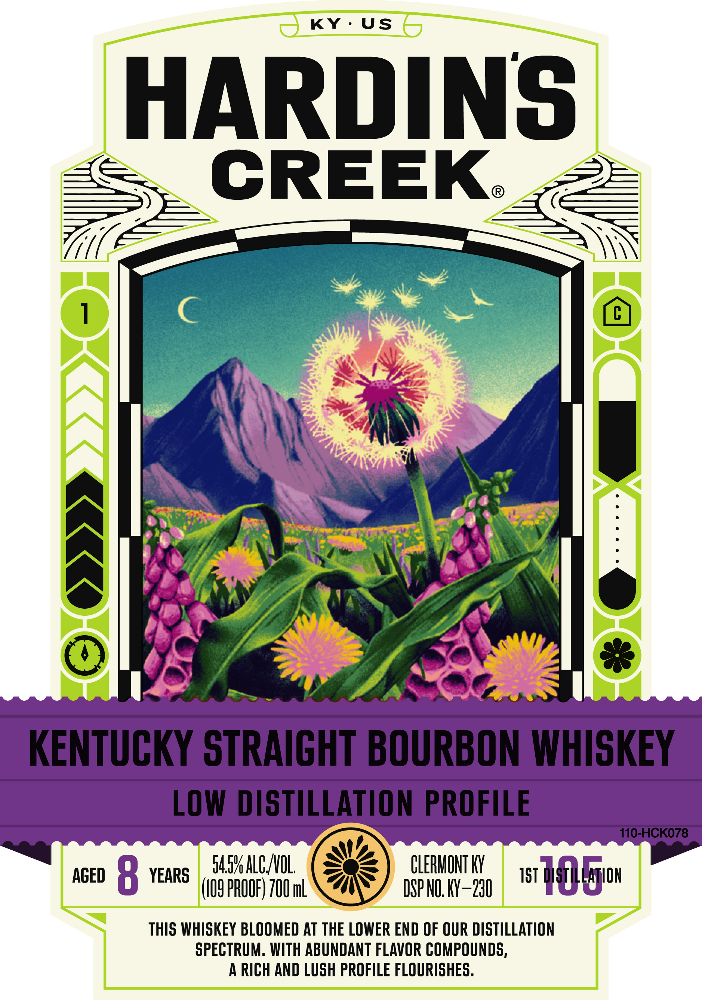
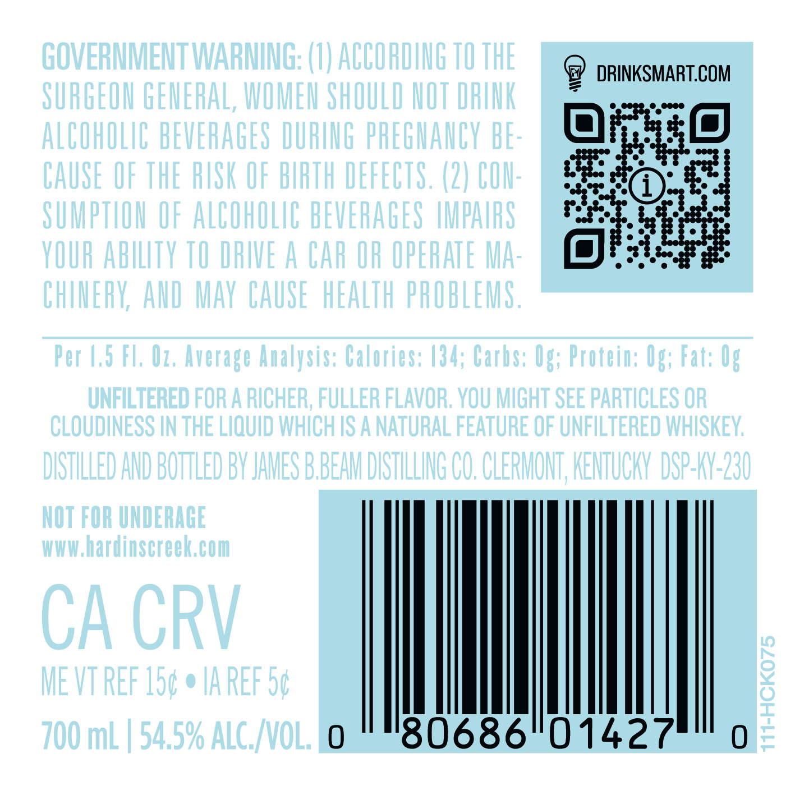

# TTB COLA Label Images - TTBID 26009001000160

**Brand Name:** HARDIN'S CREEK

**Issue Date:** 01/09/2026

**Origin Code:** 22

**Product Class/Type:** 101

**Source:** [TTB Public COLA Registry](https://ttbonline.gov/colasonline/viewColaDetails.do?action=publicFormDisplay&ttbid=26009001000160)

## Label Images

### Label 1

### Label 2

### Label 3

## Extracted Label Text

*Text extracted via OCR - may contain errors*

### Label 1

KY-US

HARDINS:

CREEK

=

IN

y \

ay

A

qi

By

i als

\ ae |

5

—t,

x

Sg)

a.

S

ny

y

fay

{5 7

CLERMONT KY

AGED 8 YEAR

M54 AL VOL

DSP NO. KY-230

1st 04} Bion

109 PROOF) 700 mL

THIS WHISKEY BLOOMED AT THE LOWER END OF OUR DISTILLATION

SPECTRUM. WITH ABUNDANT FLAVOR COMPOUNDS

A RICH AND LUSH PROFILE FLOURISHES

### Label 2

@ DRINKSMART.COM

£10)

u

is

|

80686°01427

### Label 3

DISTILLED AND BOTTLED BY

CLERMONT

KENTUCKY

4

°

t

JAMES BBEAM

DISTILLING CO.

A WHOLE NEW WORLD BEGINS AT HARDIN'S CREEK
