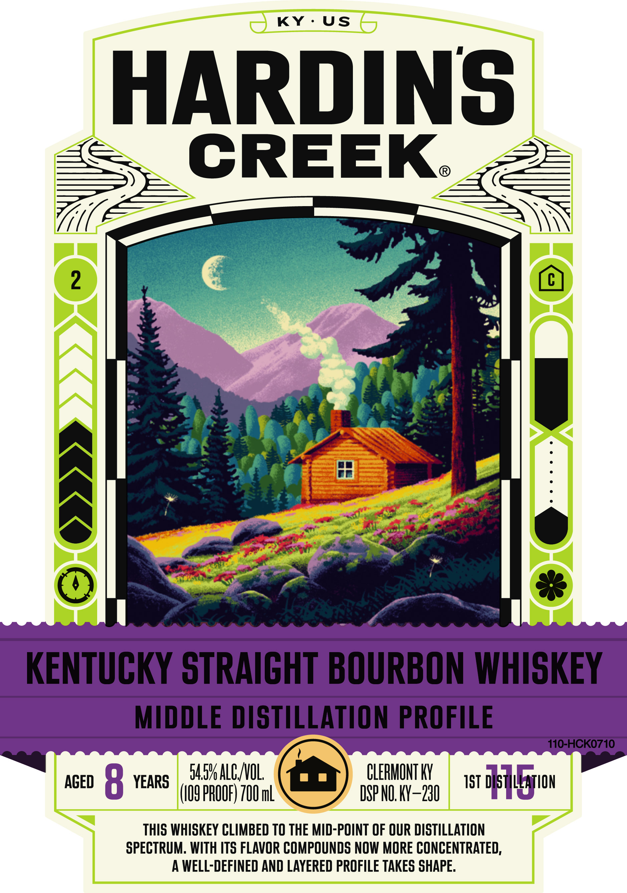
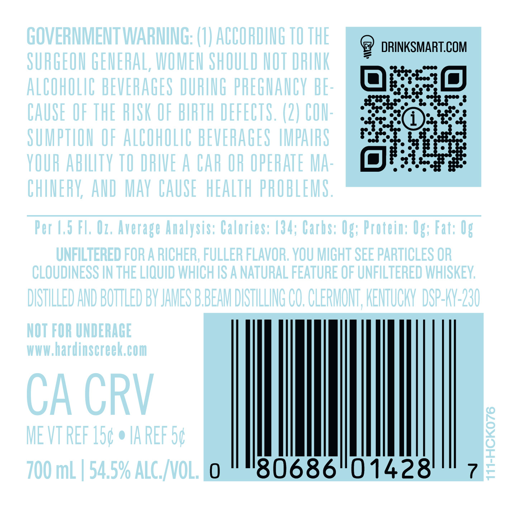
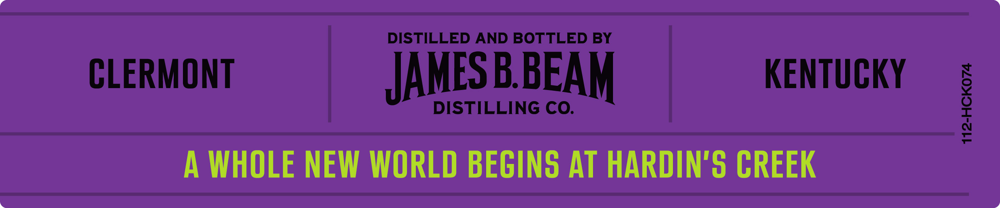

# TTB COLA Label Images - TTBID 26009001000177

**Brand Name:** HARDIN'S CREEK

**Issue Date:** 01/09/2026

**Origin Code:** 22

**Product Class/Type:** 101

**Source:** [TTB Public COLA Registry](https://ttbonline.gov/colasonline/viewColaDetails.do?action=publicFormDisplay&ttbid=26009001000177)

## Label Images

### Label 1

### Label 2

### Label 3

## Extracted Label Text

*Text extracted via OCR - may contain errors*

*1 image(s) excluded: text did not meet readability threshold*

### Label 1

—) KY: , KY: US (

HARDINS

CREEK.

_,,

ree

m7

a

Xx

hs

e¢

Pe cet

i

Te gt

te

Pe ge

tg ae

fry |

wh

i

~ KENTUCKY STRAIGHT BOURBON WHISKEY

MIDDLE DISTILLATION PROFILE

ywwewwewewevwvuevuvwwe

Twwewewewevwevwewewevwevwewewo uN

)-I (077

v.76 ACNOL

| i |

LERMONT KY

aceo § r a ) YEARS

(109 PROOF) 700 mL

DSP NO. KY-230

1st O} mire

THIS WHISKEY CLIMBED TO THE MID-POINT OF OUR DISTILLATION

SPECTRUM. WITH ITS FLAVOR COMPOUNDS NOW MORE CONCENTRATED

A WELL-DEFINED AND LAYERED PROFILE TAKES SHAPE

### Label 3

DISTILLED AND BOTTLED BY

CLERMONT

KENTUCKY

4

°

t

JAMES BBEAM

DISTILLING CO.

A WHOLE NEW WORLD BEGINS AT HARDIN'S CREEK
