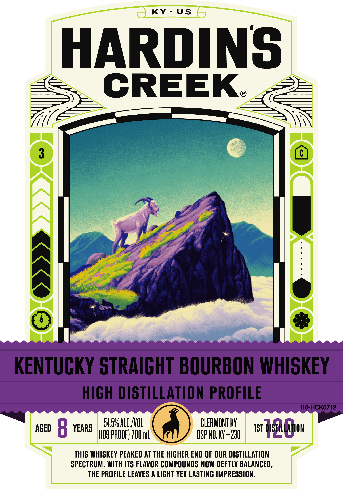
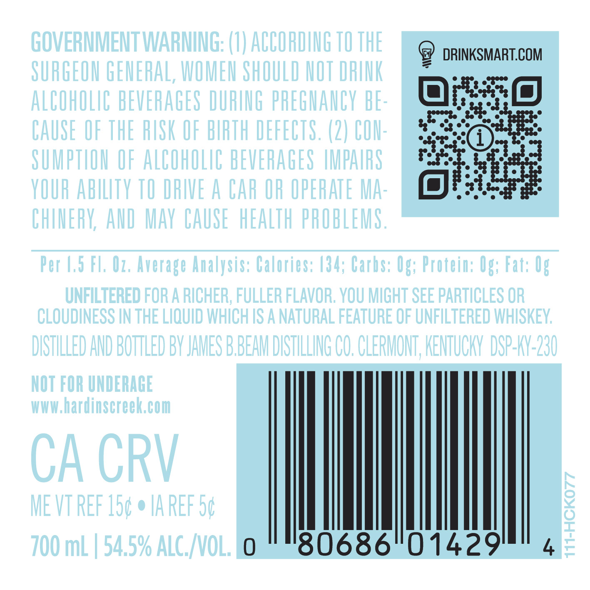

# TTB COLA Label Images - TTBID 26009001000188

**Brand Name:** HARDIN'S CREEK

**Issue Date:** 01/09/2026

**Origin Code:** 22

**Product Class/Type:** 101

**Source:** [TTB Public COLA Registry](https://ttbonline.gov/colasonline/viewColaDetails.do?action=publicFormDisplay&ttbid=26009001000188)

## Label Images

### Label 1

### Label 2

### Label 3

## Extracted Label Text

*Text extracted via OCR - may contain errors*

*1 image(s) excluded: text did not meet readability threshold*

### Label 1

KY: US

HARDINS

© oo

SASH ALGO CLERMONT KY
09 PROOF) 70 apna 8 HERG

THIS WHISKEY PEAKED AT THE HIGHER END OF OUR DISTILLATION
SPECTRUM. WITH ITS FLAVOR COMPOUNDS NOW DEFTLY BALANCED,
THE PROFILE LEAVES A LIGHT YET LASTING IMPRESSION.

AGED 8 YEARS |

### Label 3

DISTILLED AND BOTTLED BY

CLERMONT

KENTUCKY

4

°

t

JAMES BBEAM

DISTILLING CO.

A WHOLE NEW WORLD BEGINS AT HARDIN'S CREEK
