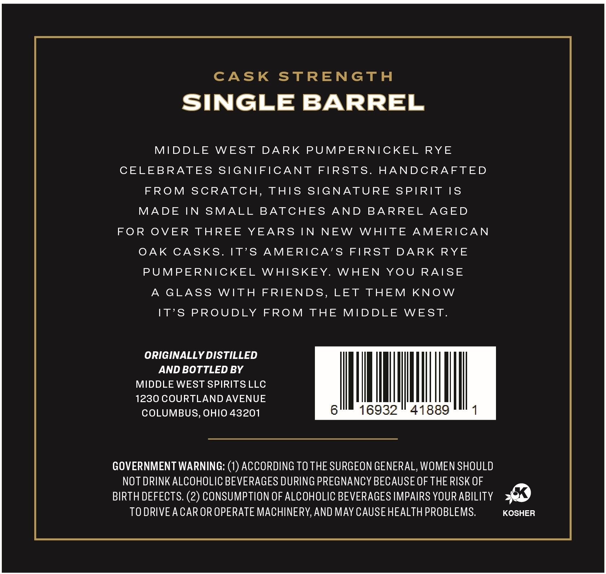

# TTB COLA Label Images - TTBID 26009001000614

**Brand Name:** MIDDLE WEST SPIRITS

**Issue Date:** 02/05/2026

**Origin Code:** 09

**Product Class/Type:** 102

**Source:** [TTB Public COLA Registry](https://ttbonline.gov/colasonline/viewColaDetails.do?action=publicFormDisplay&ttbid=26009001000614)

## Label Images

### Back Label

### Front Label

### Label 4

## Extracted Label Text

*Text extracted via OCR - may contain errors*

### Back Label

CASK STRENGTH

SINGLE BARREL

MIDDLE WEST DARK PUMPERNICKEL RYE

CELEBRATES SIGNIFICANT FIRSTS. HANDCRAFTED

FROM SCRATCH, THIS SIGNATURE SPIRIT IS

MADE IN SMALL BATCHES AND BARREL AGED

FOR OVER THREE YEARS IN NEW WHITE AMERICAN

OAK CASKS

IT’S AMERICA’S FIRST DARK RYE

PUMPERNICKEL WHISKEY. WHEN YOU RAISE

A GLASS WITH FRIENDS, LET THEM KNOW

IT’S PROUDLY FROM THE MIDDLE WEST

ORIGINALLY DISTILLED

AND BOTTLED BY

MIDDLE WEST SPIRITS LLC

1230 COURTLAND AVENUE

|

IMUM

COLUMBUS, OHIO 43201

16932 " 41889

GOVERNMENT WARNING: (1) ACCORDING TO THE SURGEON GENERAL, WOMEN SHOULD

NOT DRINK ALCOHOLIC BEVERAGES DURING PREGNANCY BECAUSE OF THE RISK OF

BIRTH DEFECTS. (2) CONSUMPTION OF ALCOHOLIC BEVERAGES IMPAIRS YOUR ABILITY 9

TO DRIVE A CAR OR OPERATE MACHINERY, AND MAY CAUSE HEALTH PROBLEMS

KOSHER

### Front Label

‘SINGLE BARREL:

Message Up To 45 Characters

129.43

PROOF

BARRELED ON

02/14/18

BARREL NO.

18-0280

AGE

uf

ALC/VOL

64.72%

750

ML

### Label 4

60

OH
