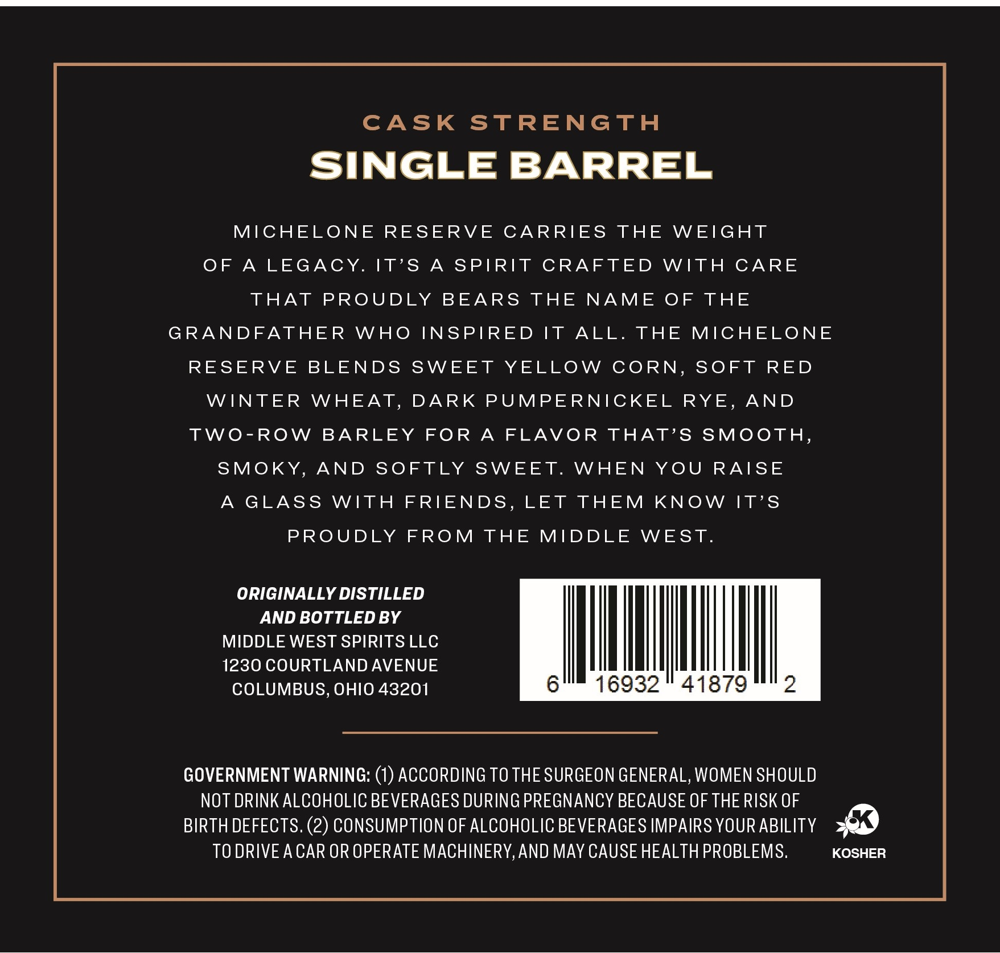
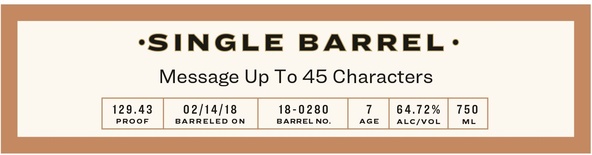

# TTB COLA Label Images - TTBID 26009001000617

**Brand Name:** MIDDLE WEST SPIRITS

**Issue Date:** 02/05/2026

**Origin Code:** 09

**Product Class/Type:** 101

**Source:** [TTB Public COLA Registry](https://ttbonline.gov/colasonline/viewColaDetails.do?action=publicFormDisplay&ttbid=26009001000617)

## Label Images

### Back Label

### Front Label

### Label 4

## Extracted Label Text

*Text extracted via OCR - may contain errors*

*2 image(s) excluded: text did not meet readability threshold*

### Back Label

CASK STRENGTH

SINGLE BARREL

MICHELONE RESERVE CARRIES THE WEIGHT

OF A LEGACY.

IT’S A SPIRIT CRAFTED WITH CARE

THAT PROUDLY BEARS THE NAME OF THE

GRANDFATHER WHO INSPIRED IT ALL. THE MICHELONE

RESERVE BLENDS SWEET YELLOW CORN, SOFT RED

WINTER WHEAT, DARK PUMPERNICKEL RYE, AND

TWO-ROW BARLEY FOR A FLAVOR THAT’S SMOOTH,

SMOKY, AND SOFTLY SWEET. WHEN YOU RAISE

A GLASS WITH FRIENDS, LET THEM KNOW IT’S

PROUDLY FROM THE MIDDLE WEST.

ORIGINALLY DISTILLED

AND BOTTLED BY

MIDDLE WEST SPIRITS LLC

InN

1230 COURTLAND AVENUE

COLUMBUS, OHIO 43201

6

16932 " 41879

2

GOVERNMENT WARNING: (1) ACCORDING TO THE SURGEON GENERAL, WOMEN SHOULD

NOT DRINK ALCOHOLIC BEVERAGES DURING PREGNANCY BECAUSE OF THE RISK OF

BIRTH DEFECTS. (2) CONSUMPTION OF ALCOHOLIC BEVERAGES IMPAIRS YOUR ABILITY 9

TO DRIVE ACAR OR OPERATE MACHINERY, AND MAY CAUSE HEALTH PROBLEMS.

KOSHER
