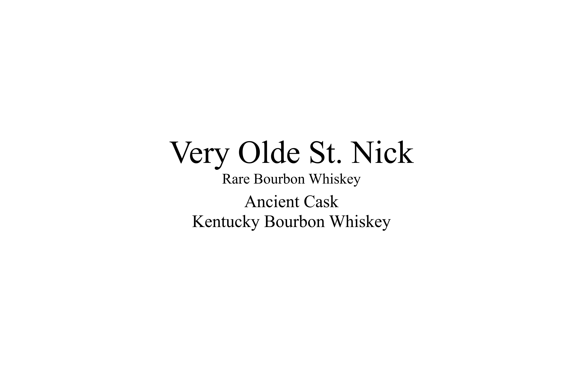
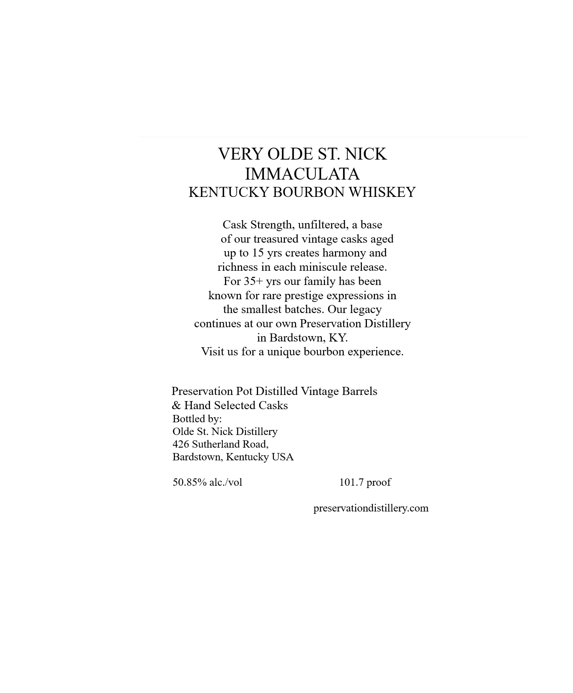

# TTB COLA Label Images - TTBID 26009001000719

**Brand Name:** VERY OLDE ST. NICK

**Issue Date:** 01/12/2026

**Origin Code:** 22

**Product Class/Type:** 141

**Source:** [TTB Public COLA Registry](https://ttbonline.gov/colasonline/viewColaDetails.do?action=publicFormDisplay&ttbid=26009001000719)

## Label Images

### Back Label

### Label 1

### Label 3

### Label 4

## Extracted Label Text

*Text extracted via OCR - may contain errors*

### Back Label

Very Olde St. Nick

Rare Bourbon Whiskey

Ancient Cask

Kentucky Bourbon Whiskey

### Label 1

VERY OLDE ST. NICK

IMMACULATA

KENTUCKY BOURBON WHISKEY

Cask Strength, unfiltered, a base

of our treasured vintage casks aged

up to 15 yrs creates harmony and

richness in each miniscule release.

For 35+ yrs our family has been

known for rare prestige expressions in

the smallest batches. Our legacy

continues at our own Preservation Distillery

in Bardstown, KY.

Visit us for a unique bourbon experience.

Preservation Pot Distilled Vintage Barrels

& Hand Selected Casks

Bottled by:

Olde St. Nick Distillery

426 Sutherland Road,

Bardstown, Kentucky USA

50.85% alc./vol

101.7 proof

preservationdistillery.com

### Label 3

ARTISAN

Ancient

RARE

CRAFTED

Cask

VINTAGE

IMMACULATA

### Label 4

GOVERNMENT WARNING:

1) ACCORDING TO THE

SURGEON GENERAL

SHOULD NOT DRINK

ALCOHOLIC

BEVERAGES

DURING

PREGNA

BECAUSE OF THE RISK OF BIRTH DEFFECTS.

NSUMPTION

0

ALCOHOLIC

BEVERAG

x

IMPAIRS YOUR

OPERATE MACHINERY,

HEALTH

PROBLEMS.

750ML
