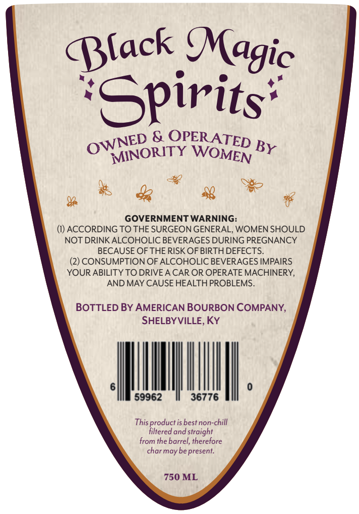
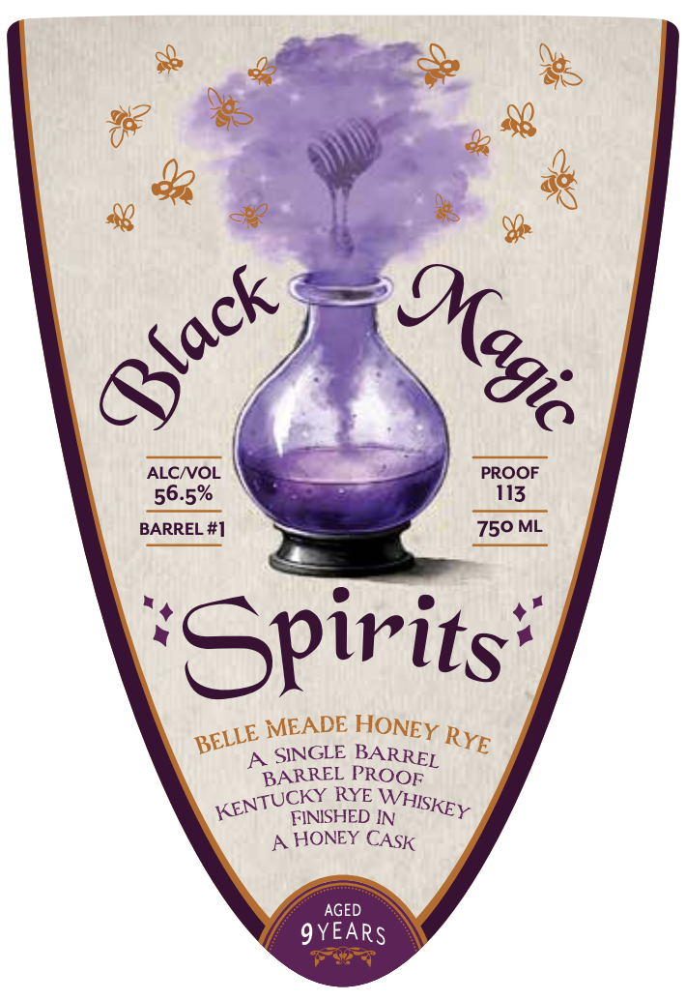

# TTB COLA Label Images - TTBID 26011001000032

**Brand Name:** BLACK MAGIC SPIRITS

**Issue Date:** 01/12/2026

**Origin Code:** 22

**Product Class/Type:** 142

**Source:** [TTB Public COLA Registry](https://ttbonline.gov/colasonline/viewColaDetails.do?action=publicFormDisplay&ttbid=26011001000032)

## Label Images

### Back Label

### Front Label

## Extracted Label Text

*Text extracted via OCR - may contain errors*

### Back Label

Black Magic

+

NM

piri ts’

NED & OPERATED

D By

Oo

VYINORITY WOMEN BY

mF

uo *® &

¥

GOVERNMENT WARNING:

(1) ACCORDING TO THE SURGEON GENERAL, WOMEN SHOULD

NOT DRINK ALCOHOLIC BEVERAGES DURING PREGNANCY

BECAUSE OF THE RISK OF BIRTH DEFECTS.

(2) CONSUMPTION OF ALCOHOLIC BEVERAGES IMPAIRS

YOUR ABILITY TO DRIVE A CAR OR OPERATE MACHINERY,

AND MAY CAUSE HEALTH PROBLEMS.

BOTTLED BY AMERICAN BOURBON COMPANY,

SHELBYVILLE, KY

UM

This product is best non-chill

filtered and straight

from the barrel, therefore

char may be present.

750 ML

### Front Label

MEADE HONEY
SINGLE BA
BARREL PROOE

TUCKY RYE Wj
KENTUNISHED IN SKEY

A. HONEY CAsk

1B
pee Ryg
