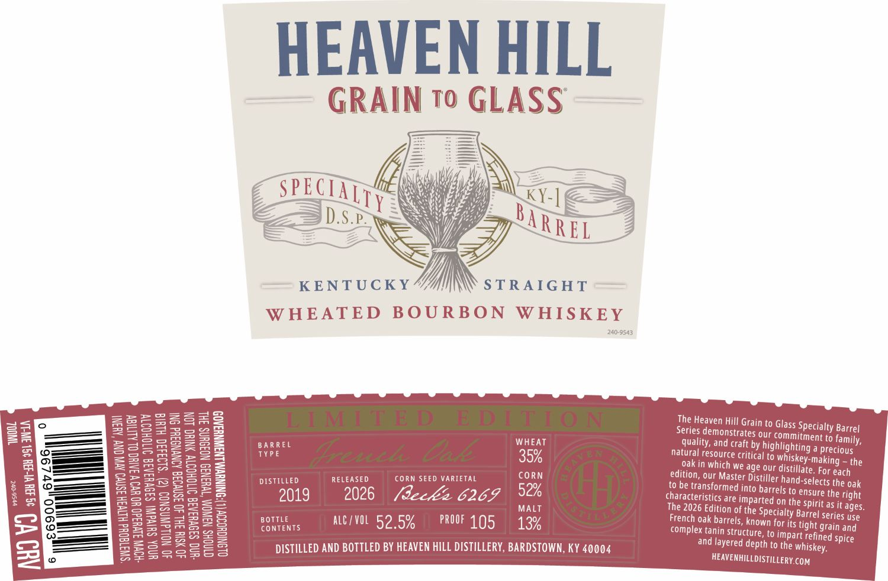
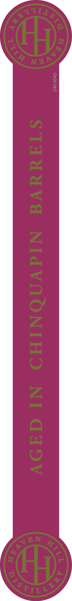

# TTB COLA Label Images - TTBID 26012001000181

**Brand Name:** HEAVEN HILL

**Fanciful Name:** GRAIN TO GLASS

**Issue Date:** 01/12/2026

**Origin Code:** 22

**Product Class/Type:** 141

**Source:** [TTB Public COLA Registry](https://ttbonline.gov/colasonline/viewColaDetails.do?action=publicFormDisplay&ttbid=26012001000181)

## Label Images

### Label 1

### Label 2

## Extracted Label Text

*Text extracted via OCR - may contain errors*

### Label 1

HEAVEN HILL

GRAIN to GLASS

——

=

Wy

L2a—

SPE

CIA

Ne

yy

Ly

if

S

We,

KY-]

SKS

4

ve

yy

yy

_—F

D.s

i

<———__—

y

Wf

SAR

REL

——S—_ ZB

£8

\

Yi,

KENTUCKY

STRAIGHT

WHEATED BOURBON WHISKEY

240-9543

a6

as

= oS Sim

2228

The Heaven Hill Grai

=

SoS

S2=3

sens

Series demonstrates

n to Glass Specialty Barrel

our commitmen

23

i —

ay

mesa

BARREL

WHEAT

quality, and craft b

t to family,

=

Sa

TYPE

natural resource criti

y highlighting a

precious

—

S22 >= 4

SpSBSe

25

Q=

35%

oak in which we a

cal to whiskey-making ~ the

pe ————}

Se

set

CORN

edition, our Master

ge our distillate, For each

—

Se

2S

Sone

DIST

a)

RELEASED

CORN SEED VARIETAL

Distiller hand-:

Selects the oak

=

————

mas

Sa

52%

to be transformed in

to barrels to ey

nisure the right

S=

BS

Zon

SAne

moms

19

2026 (decks 6269

Characteristics are im

parted on th

oS

Ss

I

mes

MALT

The 2026 Edition of t

fe Specialty

Barrel series use

le spirit as it ages

—_—_—

=a

sme

S23

2as

BOTTLE

ALC/VOL 52 5%

PROOF 195

13%

French oak barrels, ki

B2SazBS

SAltames

ONTENTS

complex tanin struct

ure, to impart refi

nown for its tight grain and

=

ez

Ses2=2c085

aS

Se

and layered d

lepth to the whisk

ned spice

_——

SSEo

Bes

Sees

BS

DISTILLED AND BOTTLED BY HEAVEN HILL DISTILLERY, BARDSTOWN, KY 40004

ey.

HEAVENHILLDISTILLERY.coM,

### Label 2

Wy
