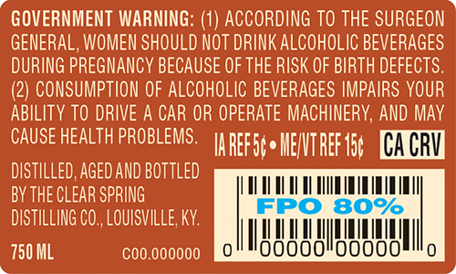
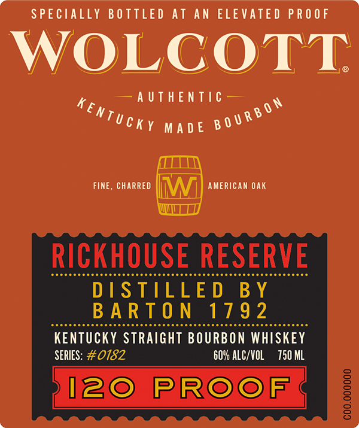
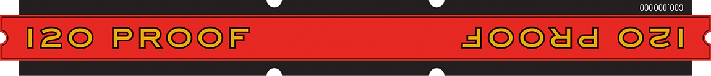

# TTB COLA Label Images - TTBID 26012001000315

**Brand Name:** WOLCOTT RICKHOUSE RESERVE

**Issue Date:** 01/13/2026

**Origin Code:** 22

**Product Class/Type:** 101

**Source:** [TTB Public COLA Registry](https://ttbonline.gov/colasonline/viewColaDetails.do?action=publicFormDisplay&ttbid=26012001000315)

## Label Images

### Back Label

### Label 1

### Label 3

## Extracted Label Text

*Text extracted via OCR - may contain errors*

### Back Label

CACRY

LTCC

|

WAM

MIN IB

ll

0

00000

00000:

(e)

### Label 1

SPECIALLY BOTTLED AT AN ELEVATED PROOF

WOLCOTT.

4

SAUTE L IG

AN

Uchy wane B0r®

(TLL1N\

Fine, cHARRED ||\/\/)} AMERICAN oAK

WITT

RICKHOUSE RESERVE

D IS

ELE

Y

E

### Label 3

=

CN

2 IZ© IP IROOlF

EIOOrEle| Ol] C

=

;
