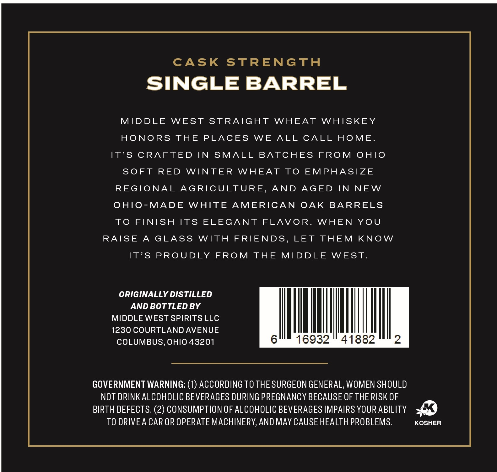
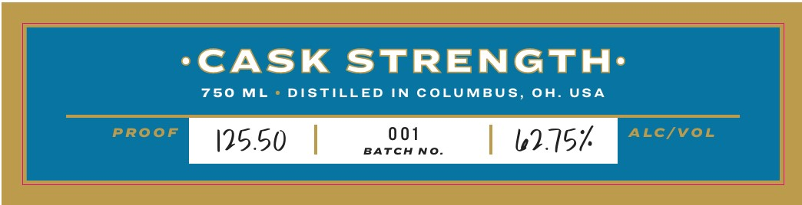

# TTB COLA Label Images - TTBID 26012001000357

**Brand Name:** MIDDLE WEST SPIRITS

**Issue Date:** 01/13/2026

**Origin Code:** 09

**Product Class/Type:** 109

**Source:** [TTB Public COLA Registry](https://ttbonline.gov/colasonline/viewColaDetails.do?action=publicFormDisplay&ttbid=26012001000357)

## Label Images

### Back Label

### Front Label

### Label 4

## Extracted Label Text

*Text extracted via OCR - may contain errors*

*2 image(s) excluded: text did not meet readability threshold*

### Back Label

CASK STRENGTH

SINGLE BARREL

MIDDLE WEST STRAIGHT WHEAT WHISKEY

HONORS THE PLACES WE ALL CALL HOME.

IT’S CRAFTED IN SMALL BATCHES FROM OHIO

SOFT RED WINTER WHEAT TO EMPHASIZE

REGIONAL AGRICULTURE, AND AGED IN NEW

OHIO-MADE WHITE AMERICAN OAK BARRELS

TO FINISH ITS ELEGANT FLAVOR. WHEN YOU

RAISE A GLASS WITH FRIENDS, LET THEM KNOW

IT’S PROUDLY FROM THE MIDDLE WEST.

ORIGINALLY DISTILLED

AND BOTTLED BY

MIDDLE WEST SPIRITS LLC

1230 COURTLAND AVENUE

MANN

COLUMBUS, OHIO 43201

GOVERNMENT WARNING: (1) ACCORDING TO THE SURGEON GENERAL, WOMEN SHOULD

NOT DRINK ALCOHOLIC BEVERAGES DURING PREGNANCY BECAUSE OF THE RISK OF

BIRTH DEFECTS. (2) CONSUMPTION OF ALCOHOLIC BEVERAGES IMPAIRS YOUR ABILITY

TO DRIVEA CAR OR OPERATE MACHINERY, AND MAY CAUSE HEALTH PROBLEMS.

KOSHER
