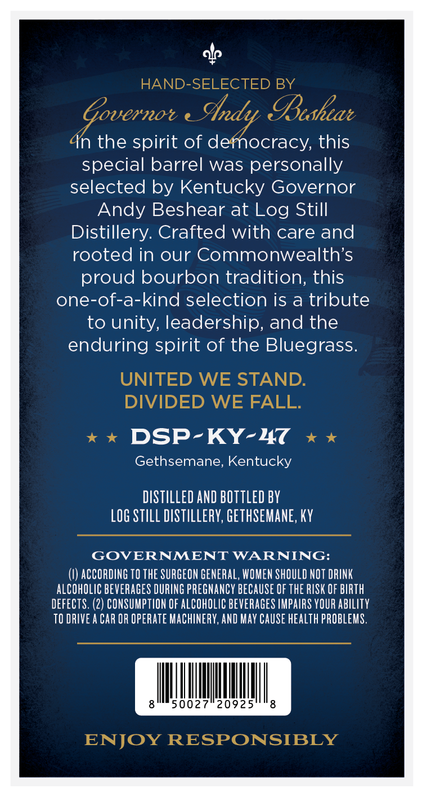
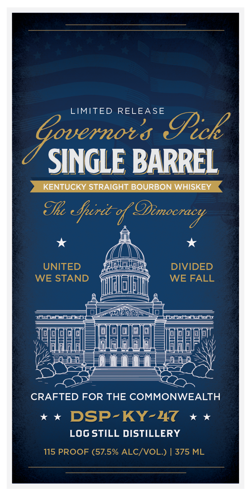

# TTB COLA Label Images - TTBID 26012001000623

**Brand Name:** GOVERNOR'S PICK

**Issue Date:** 01/13/2026

**Origin Code:** 22

**Product Class/Type:** 101

**Source:** [TTB Public COLA Registry](https://ttbonline.gov/colasonline/viewColaDetails.do?action=publicFormDisplay&ttbid=26012001000623)

## Label Images

### Back Label

### Front Label

### Label 3

## Extracted Label Text

*Text extracted via OCR - may contain errors*

### Back Label

HAND-SELECTED BY
2 :
agi ae Pushear
n the spirit of defnocracy, this
special barrel was personally
selected by Kentucky Governor
Andy Beshear at Log Still
Distillery. Crafted with care and
rooted in our Commonwealth's
proud bourbon tradition, this
one-of-a-kind selection is a tribute
to unity, leadership, and the
enduring spirit of the Bluegrass.
UNITED WE STAND.
DIVIDED WE FALL.
xx DSP-KY-HT «x
Gethsemane, Kentucky
DISTILLED AND BOTTLED BY
LOG STILL DISTILLERY, GETHSEMANE, KY
GOVERNMENT WARNING:

(\) ACCORDING TO THE SURGEON GENERAL, WOMEN SHOULD NOT DRINK
ALCOHOLIC BEVERAGES DURING PREGNANCY BECAUSE OF THE RISK OF BIRTH
DEFECTS. (2) CONSUMPTION OF ALCOHOLIC BEVERAGES IMPAIRS YOUR ABILITY
TO DRIVE A CAR OR OPERATE MACHINERY, AND MAY CAUSE HEALTH PROBLEMS.

AIINNNNN,
ENJOY RESPONSIBLY

### Front Label

LIMITED RELEASE
* ;
5 Such
SINGLE

INGLE BARREL
"KENTUCKY STRAIGHT BOURBON WHISKEY

The cherie of Dinccracy

* 4 *
(

UNITED {@@SE) DIVIDED
WE STAND asics WE FALL
ee
anny peel eee

HEE NECN =| OI/9/2) al =a yaaa
SEEEEEL_FEPRE| EERE
Sar
CRAFTED FOR THE COMMONWEALTH
x *x DSP-KY-HC xx
LOG STILL DISTILLERY
115 PROOF (57.5% ALC/VOL.) | 375 ML

### Label 3

** * SINGLE BARREL ~* * *
"evi stelok SoURGON WHISKEY
