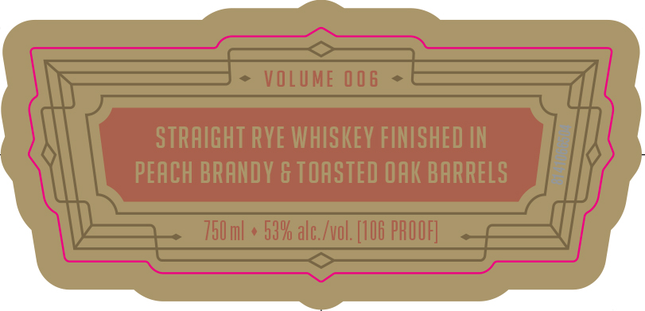
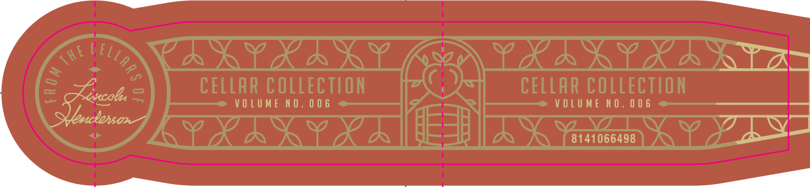
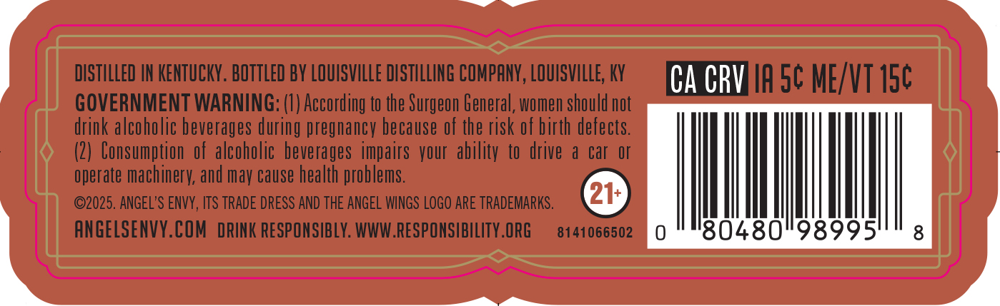
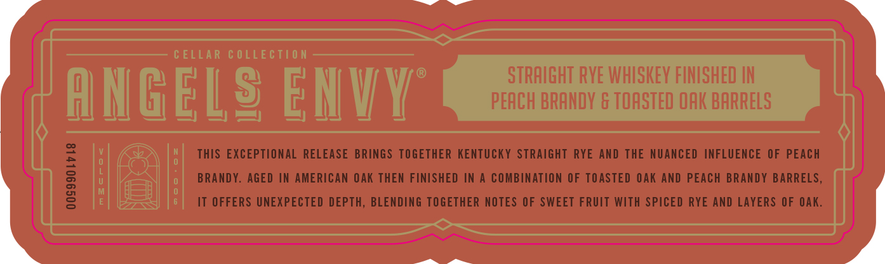
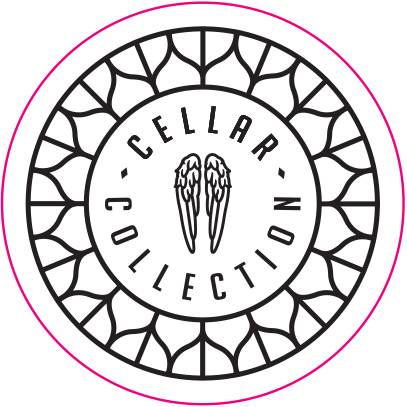

# TTB COLA Label Images - TTBID 26013001000570

**Brand Name:** ANGELS ENVY

**Fanciful Name:** CELLAR COLLECTION

**Issue Date:** 01/14/2026

**Origin Code:** 22

**Product Class/Type:** 102

**Source:** [TTB Public COLA Registry](https://ttbonline.gov/colasonline/viewColaDetails.do?action=publicFormDisplay&ttbid=26013001000570)

## Label Images

### Label 1

### Label 2

### Label 3

### Label 4

### Label 5

### Label 6

## Extracted Label Text

*Text extracted via OCR - may contain errors*

### Label 1

~

N

NN

ip

a

Lf

Wy)

mi A

N

CAT

AX

\

AN

/

‘

### Label 2

|

|

\{

(

|

\

f

\

|

\

### Label 3

Se

———

Rat bE

LA

|

a)

CELLAR COLLECTION

VOLUME NO. 006

CELLAR COLLECTION

VOLUME NO. 006

LS

CT

—

==

=

ee —_»<,

### Label 4

DISTILLED IN KENTUCKY. BOTTLED BY LOUISVILLE DISTILLING COMPANY, LOUISVILLE, KY

CAMAETT IA S¢ ME/VT 15¢

GOVERNMENT WARNING: (1) According to the Surgeon General, women should not

drink alcoholic beverages during pregnancy because of the risk of birth defects.

(2) Consumption of alcoholic beverages impairs your ability to drive a car or

operate machinery, and may cause health problems

©2025. ANGEL'S ENVY, ITS TRADE DRESS AND THE ANGEL WINGS LOGO ARE TRADEMARKS.

ANGELSENVY.COM DRINK RESPONSIBLY. WWW.RESPONSIBILITY.ORG

8141066502

### Label 5

————

/

a

Li 5}

KEN

0

THIS EXCEPTIONAL RELEASE BRINGS TOGETHER KENTUCKY STRAIGHT RYE AND THE NUANCED INFLUENCE OF PEACH

u

=)

Q

BRANDY. AGED IN AMERICAN OAK THEN FINISHED IN A COMBINATION OF TOASTED OAK AND PEACH BRANDY BARRELS,

i)

8

IT OFFERS UNEXPECTED DEPTH, BLENDING TOGETHER NOTES OF SWEET FRUIT WITH SPICED RYE AND LAYERS OF OAK.

Se ae

### Label 6

YN

Ld

VASO

A

“lees

iN

/U/

YY

%

)
