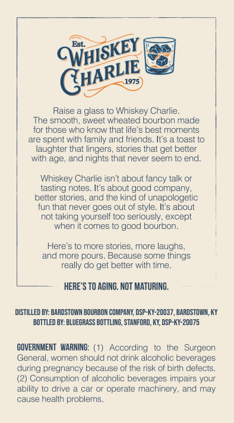
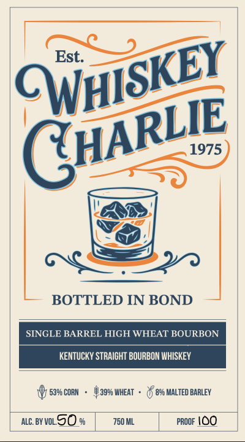
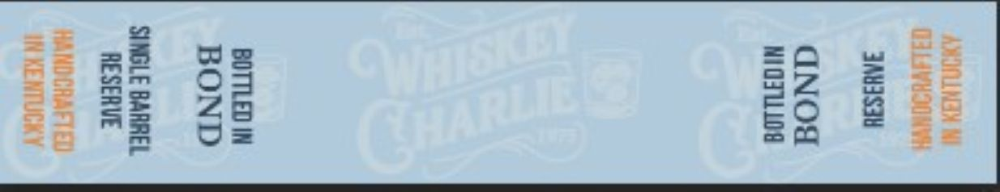

# TTB COLA Label Images - TTBID 26013001000689

**Brand Name:** WHISKEY CHARLIE

**Issue Date:** 01/14/2026

**Origin Code:** 22

**Product Class/Type:** 111

**Source:** [TTB Public COLA Registry](https://ttbonline.gov/colasonline/viewColaDetails.do?action=publicFormDisplay&ttbid=26013001000689)

## Label Images

### Back Label

### Front Label

### Label 2

## Extracted Label Text

*Text extracted via OCR - may contain errors*

### Back Label

“est EY

—)

a

Raise a glass to Whiskey Charlie.

The smooth, sweet wheated bourbon made

for those who know that life's best moments

are spent with family and friends. It's a toast to

laughter that lingers, stories that get better

with age, and nights that never seem to end.

Whiskey Charlie isn't about fancy talk or

tasting notes. It's about good company,

better stories, and the kind of unapologetic

fun that never goes out of style. It's about

not taking yourself too seriously, except

when it comes to good bourbon.

Here's to more stories, more laughs,

and more pours. Because some things

really do get better with time,

HERE'S TO AGING. NOT MATURING.

DISTILLED BY: BARDSTOWN BOURBON COMPANY, DSP-KY-20037, BARDSTOWN, KY

‘BOTTLED BY: BLUEGRASS BOTTLING, STANFORD, KY, DSP-KY-20075

GOVERNMENT WARNING: (1) According to the Surgeon

General, women should not drink alcoholic beverages

during pregnancy because of the risk of birth defects.

(2) Consumption of alcoholic beverages impairs your

ability to drive a car or operate machinery, and may

cause health problems.

### Front Label

in SE)

St.

Sark

CW

G

\

CP

BOTTLED IN BOND

si

E BARREL HIGH WHEAT BOURBON

KENTUCKY STRAIGHT BOURBON WHISKEY

1) save conn - aan wear - Qf e% MALTED BARLEY

mc.BYVL9O %

750ML

Poor \OO

### Label 2

=f

rm —

=5

yes

wr

Sa

ms

zz

25

=

=f
