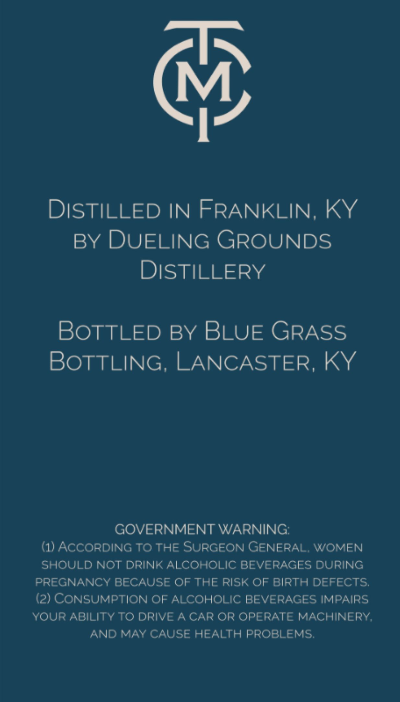
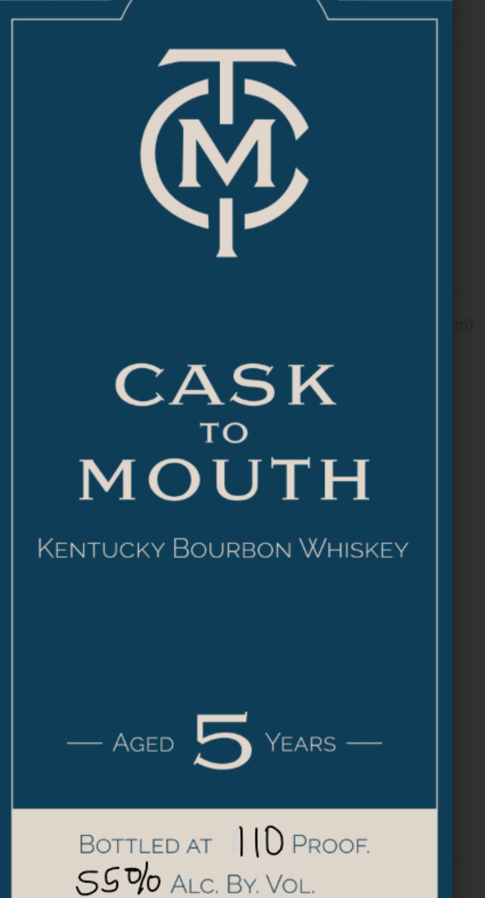

# TTB COLA Label Images - TTBID 26013001000704

**Brand Name:** TMI

**Issue Date:** 01/14/2026

**Origin Code:** 22

**Product Class/Type:** 141

**Source:** [TTB Public COLA Registry](https://ttbonline.gov/colasonline/viewColaDetails.do?action=publicFormDisplay&ttbid=26013001000704)

## Label Images

### Back Label

### Front Label

## Extracted Label Text

*Text extracted via OCR - may contain errors*

### Back Label

Z1s

™~

M

7

l

DISTILLED IN FRANKLIN, KY

BY DUELING GROUNDS

DISTILLERY

BOTTLED BY BLUE GRASS

BOTTLING, LANCASTER, KY

GOVERNMENT WARNING:

(1) ACCORDING TO THE SURGEON GENERAL, WOMEN

SHOULD NOT DRINK ALCOHOLIC BEVERAGES DURING

PREGNANCY BECAUSE OF THE RISK OF BIRTH DEFECTS

(2) CONSUMPTION OF ALCOHOLIC BEVERAGES IMPAIRS

YOUR ABILITY TO DRIVE A CAR OR OPERATE MACHINERY,

AND MAY CAUSE HEALTH PROBLEMS.

### Front Label

CASK

TO

MOUTH

KENTUCKY BOURBON WHISKEY

— AGED > YEARS —

BOTTLED AT 10) PROOF

SS Yo Atc. BY. VOL.
