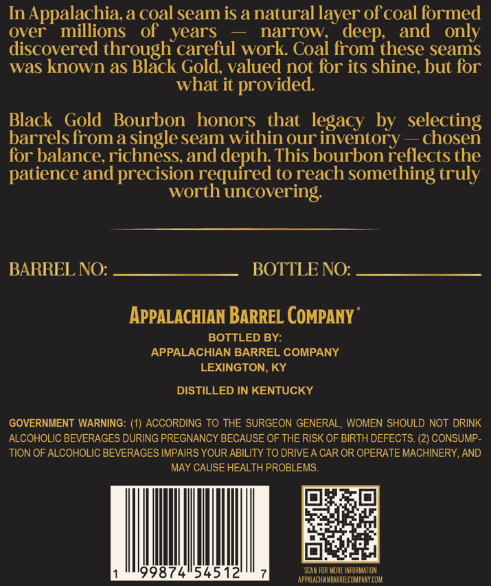
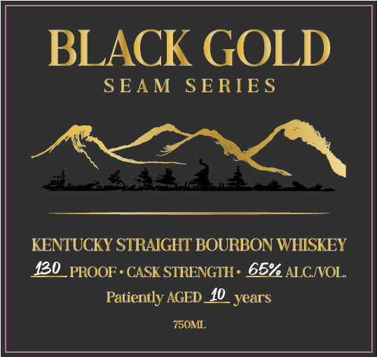

# TTB COLA Label Images - TTBID 26013001000979

**Brand Name:** BLACK GOLD

**Fanciful Name:** SEAM SERIES

**Issue Date:** 01/26/2026

**Origin Code:** 22

**Product Class/Type:** 101

**Source:** [TTB Public COLA Registry](https://ttbonline.gov/colasonline/viewColaDetails.do?action=publicFormDisplay&ttbid=26013001000979)

## Label Images

### Back Label

### Front Label

## Extracted Label Text

*Text extracted via OCR - may contain errors*

### Back Label

In Appalachia, a coal seam is a natural layer of coal formed

over millions of years — narrow, deep, and only

discovered through careful work. Coal from these seams

was known as Black Gold, valued not for its shine, but for

what it provided.

Black Gold Bourbon honors that legacy by selecting

barrels from a single seam within our inventory — chosen

for balance, richness, and depth. This bourbon reflects the

patience and precision required to reach something truly

worth uncovering.

BARREL NO:

BOTTLE NO:

APPALACHIAN BARREL COMPANY

BOTTLED BY:

APPALACHIAN BARREL COMPANY

LEXINGTON, KY

DISTILLED IN KENTUCKY

GOVERNMENT WARNING: (1) ACCORDING TO THE SURGEON GENERAL, WOMEN SHOULD NOT DRINK

ALCOHOLIC BEVERAGES DURING PREGNANCY BECAUSE OF THE RISK OF BIRTH DEFECTS. (2) CONSUMP-

TION OF ALCOHOLIC BEVERAGES IMPAIRS YOUR ABILITY TO DRIVE A CAR OR OPERATE MACHINERY, AND

MAY CAUSE HEALTH PROBLEMS.

(Obs

ae

tial

9874554512

APPALACHANBARRELCOMPANY COM

SA FOR MORE INFORMATION

### Front Label

BLACK GOLD

SEAM SERIES

POLO,

KENTUCKY STRAIGHT BOURBON WHISKEY

420 PROOF + CASK STRENGTH: 65% ALC/VOL.

Patiently AGED_£0_ years

750ML,
