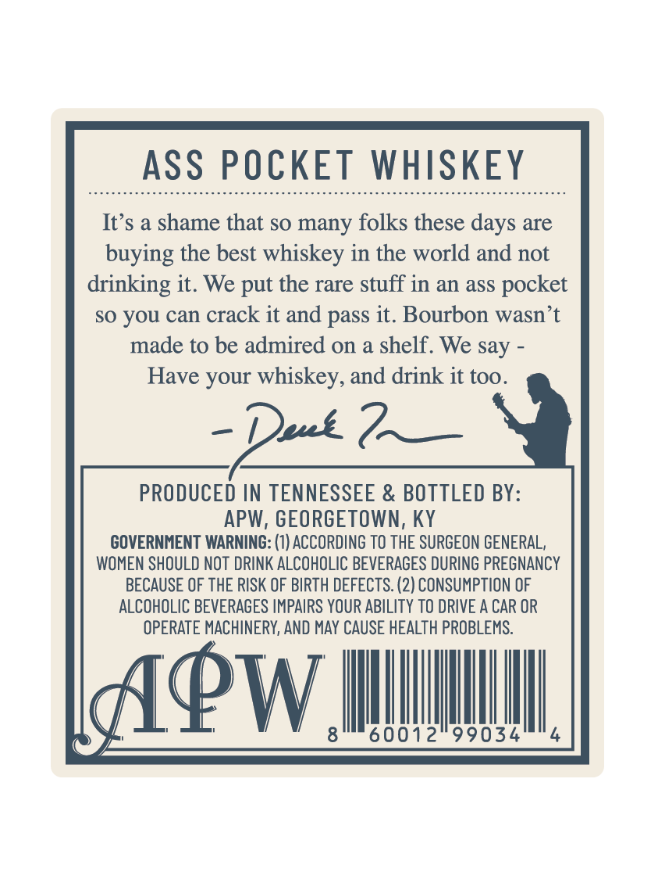
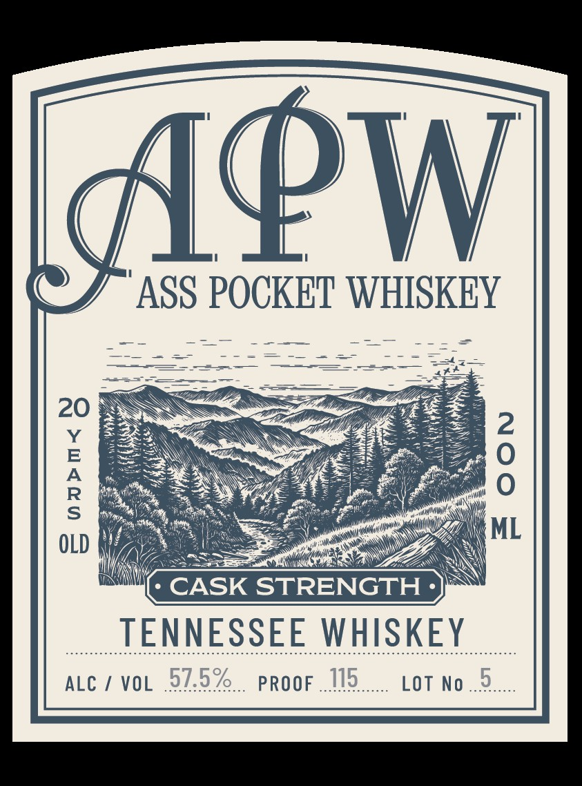

# TTB COLA Label Images - TTBID 26014001000056

**Brand Name:** APW ASS POCKET WHISKEY

**Issue Date:** 01/14/2026

**Origin Code:** 22

**Product Class/Type:** 140

**Source:** [TTB Public COLA Registry](https://ttbonline.gov/colasonline/viewColaDetails.do?action=publicFormDisplay&ttbid=26014001000056)

## Label Images

### Back Label

### Front Label

## Extracted Label Text

*Text extracted via OCR - may contain errors*

### Back Label

ASS POCKET WHISKEY

It’s a shame that so many folks these days are

buying the best whiskey in the world and not

drinking it. We put the rare stuff in an ass pocket

so you can crack it and pass it. Bourbon wasn’t

made to be admired on a shelf. We say -

Have your whiskey, and drink it too.

= Deut

PRODUCED IN TENNESSEE & BOTTLED BY:

APW, GEORGETOWN, KY

GOVERNMENT WARNING: (1) ACCORDING TO THE SURGEON GENERAL,

WOMEN SHOULD NOT DRINK ALCOHOLIC BEVERAGES DURING PREGNANCY

BECAUSE OF THE RISK OF BIRTH DEFECTS. (2) CONSUMPTION OF

ALCOHOLIC BEVERAGES IMPAIRS YOUR ABILITY TO DRIVE A CAR OR

OPERATE MACHINERY, AND MAY CAUSE HEALTH PROBLEMS.

Y/

1PW.

|

60012

99034

|

4

©

### Front Label

4

(

PW

(“4 ASS POUsaY UPS

—

==

————

=

=

——

20

ML

OLD

wh

* CASK STRENGTH -

TENNESSEE MMSE

ALC / VOL 97.5%

PROOF

LOT No
