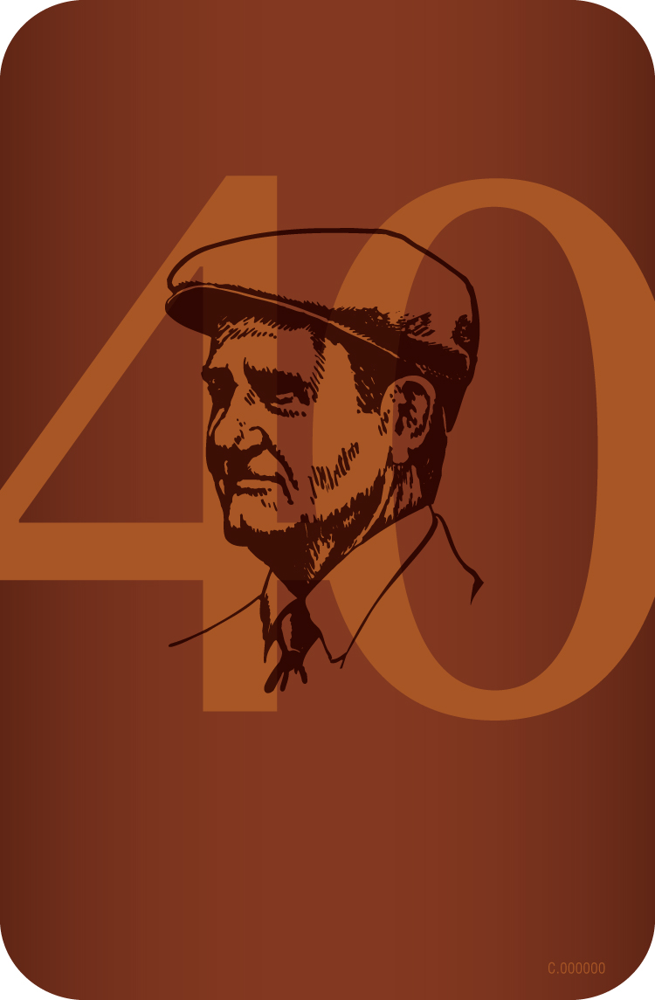
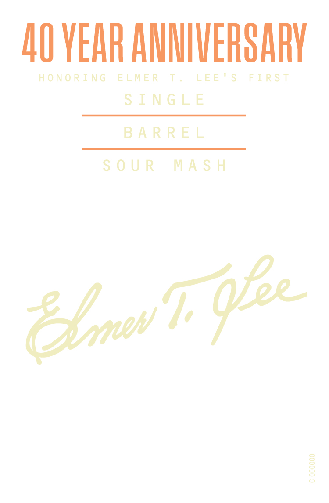
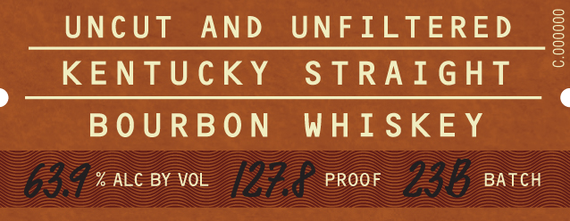

# TTB COLA Label Images - TTBID 26014001000224

**Brand Name:** ELMER T. LEE

**Fanciful Name:** 40 YEAR ANNIVERSARY

**Issue Date:** 01/14/2026

**Origin Code:** 22

**Product Class/Type:** 101

**Source:** [TTB Public COLA Registry](https://ttbonline.gov/colasonline/viewColaDetails.do?action=publicFormDisplay&ttbid=26014001000224)

## Label Images

### Back Label

### Label 1

### Label 2

## Extracted Label Text

*Text extracted via OCR - may contain errors*

*1 image(s) excluded: text did not meet readability threshold*

### Label 1

NO YEAR ANNIVERSARY

HONORING ELMER T. LEE'S FIRST
SINGLE

BARREL
SOUR MASH

cole

C.000000

### Label 2

UNCUT AND UNFILTERED

S

s

3

KENTUCKY STRAIGHT

BOURBON WHISKEY

% ALC BY VOL

PROOF

BATCH
