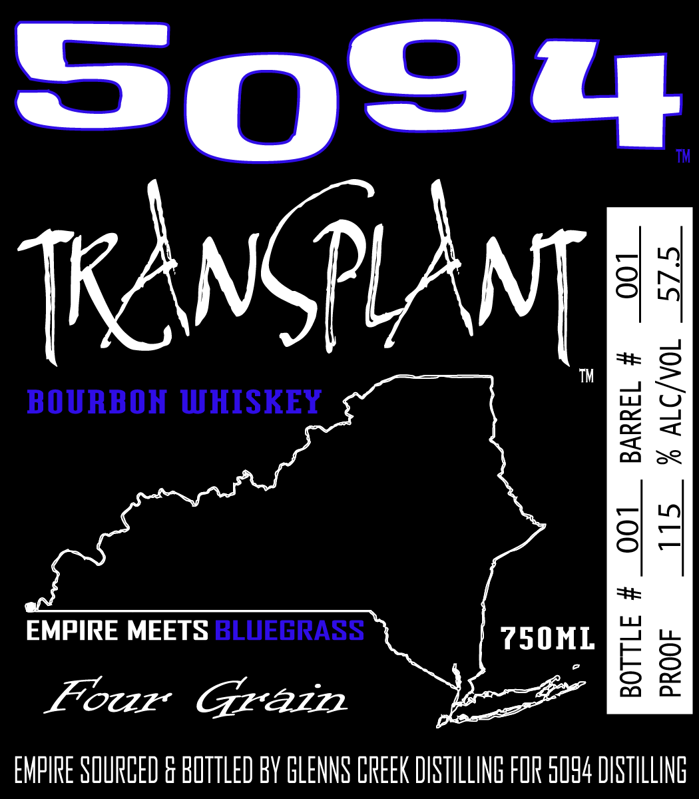
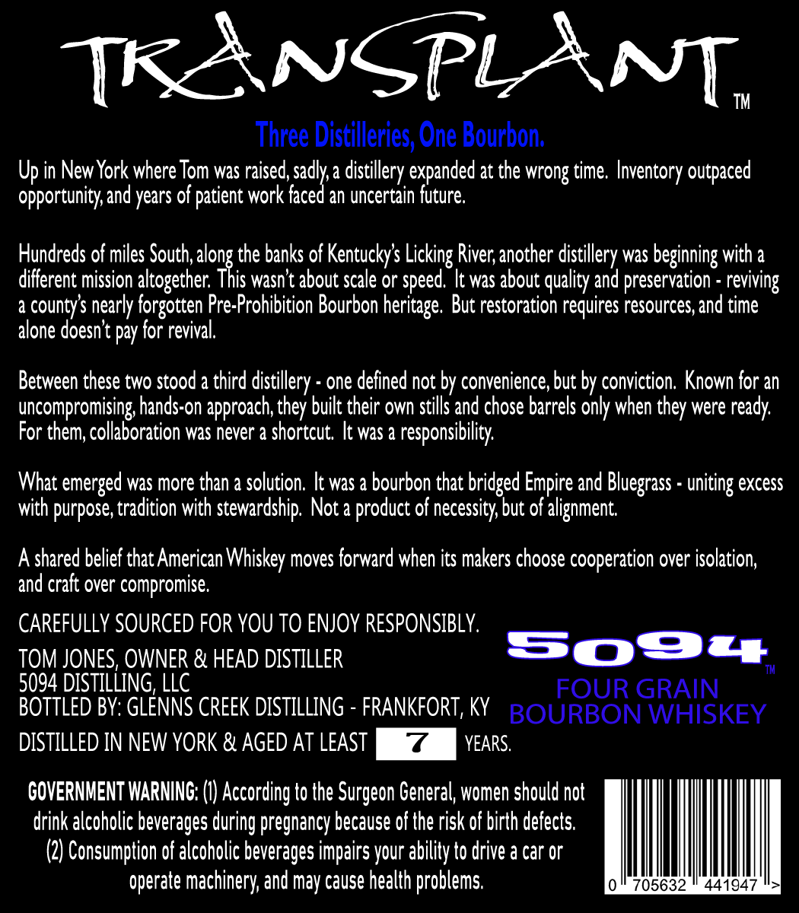

# TTB COLA Label Images - TTBID 26014001000293

**Brand Name:** 5094

**Fanciful Name:** TRANSPLANT

**Issue Date:** 01/15/2026

**Origin Code:** 22

**Product Class/Type:** 141

**Source:** [TTB Public COLA Registry](https://ttbonline.gov/colasonline/viewColaDetails.do?action=publicFormDisplay&ttbid=26014001000293)

## Label Images

### Label 1

### Label 2

## Extracted Label Text

*Text extracted via OCR - may contain errors*

### Label 1

Sogo

TM

KANGPLANT

BOURBON WHISKEY

se

EMPIRE MEETS 800058455

7SOML

four Grazr

EMPIRE SOURCED & BOTTLED BY GLENNS CREEK DISTILLING FOR 0094 DISTILLING

### Label 2

[[KANGPLANT,
Three Distilleries, One Bourbon.
Up in New York where Tom was raised, sada distillery expanded at the wrong time, Inventory outpaced
opportunity, and years of patient work faced an uncertain future.
Hundreds of miles South, dong the banks of Kentucky’s Licking River, another distillery was beginning with a
different mission altogether. This wasn’t about scale or speed. It was about quality and preservation - reviving
a county's nearly forgotten Pre-Prohibition Bourbon heritage. But restoration requires resources, and time
alone doesn’t pay for revival.
Between these two stood a third distillery - one defined not by convenience, but by conviction. Known for an
uncompromising, hands-on approach, they built their own stills and chose barrels only when they were ready.
For them, collaboration was never a shortcut. It was a responsibility.
What emerged was more than a solution. It was a bourbon that bridged Empire and Bluegrass - uniting excess
with purpose, tradition with stewardship. Not a product of necessity, but of alignment.
A shared belief that American Whiskey moves forward when its makers choose cooperation over isolation,
and craft over compromise.
CAREFULLY SOURCED FOR YOU TO ENJOY RESPONSIBLY.
TOM JONES, OWNER & HEAD DISTILLER Soe
5094 DISTILLING, LLC FOUR GRAIN
BOTTLED BY: GLENNS CREEK DISTILLING - FRANKFORT, KY BOURBON WHISKEY
DISTILLED IN NEW YORK & AGED AT LEAST YEARS,
GOVERNMENT WARNING: (I) According to the Surgeon General, women should not
drink alcoholic beverages during pregnancy because of the risk of birth defects.
(2) Consumption of alcoholic beverages impairs your ability to drive a car or
operate machinery, and may cause health problems. 0" 705632" 441947 >
