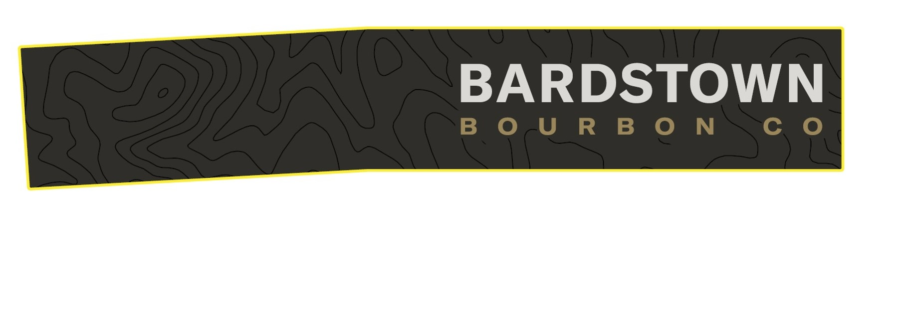
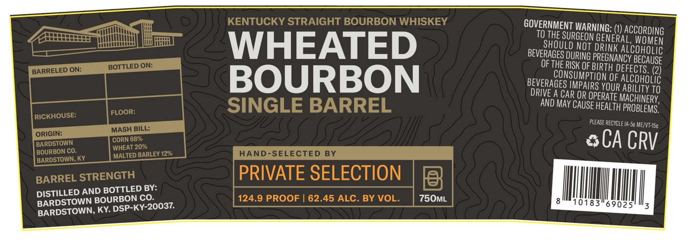

# TTB COLA Label Images - TTBID 26014001000593

**Brand Name:** BARDSTOWN BOURBON CO.

**Issue Date:** 01/20/2026

**Origin Code:** 22

**Product Class/Type:** 101

**Source:** [TTB Public COLA Registry](https://ttbonline.gov/colasonline/viewColaDetails.do?action=publicFormDisplay&ttbid=26014001000593)

## Label Images

### Back Label

### Front Label

## Extracted Label Text

*Text extracted via OCR - may contain errors*

### Back Label

BARDSTOWN

BOURBO

N

Cc O

### Front Label

GOVERNMENT WaRNINe

(1) ACCORDING

TO THE SURGEON GEN

ER,

‘AL, WOMEN

SHOULD NOT DRINK

ALCOHOLIC

WHEATED

BEVERAGES DURING PREGNA

INCY BECAUSE

OF THE RISK OF BIRTH

DEFECTS. (2

CONSUMPTION 0

F ALCOHOLIC

BOURBON

BEVERAGES IMPAIRS YOU

R ABILITY TO

DRIVE A CAR OR OPERATI

E MACHINERY,

AND MAY CAUSE HEAL

TH PROBLEMS”

PLEASE RECYDLEIA-5¢

45

&CACRV

DISTILLED AND BO

STTLED BY:

BARDSTOWN BOUR

BON CO.

750mML

ANNU

BARDSTOWN, KY. D’

SP-KY-20037.
