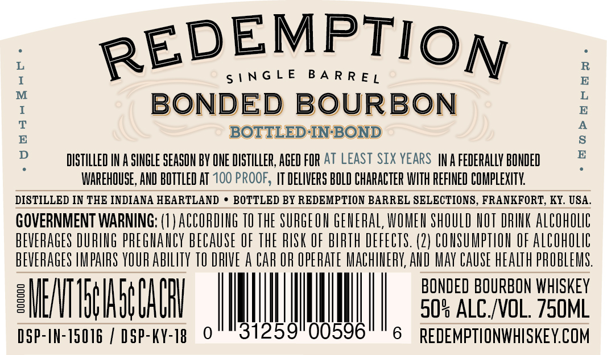
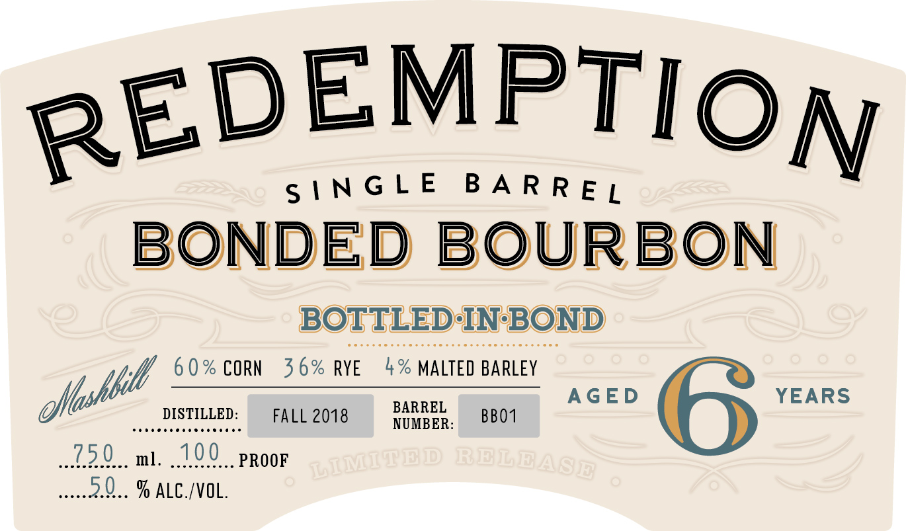
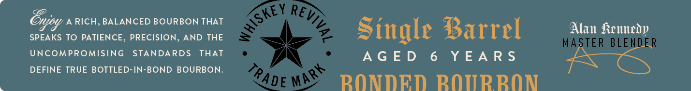

# TTB COLA Label Images - TTBID 26014001000617

**Brand Name:** REDEMPTION

**Fanciful Name:** SINGLE BARREL BONDED BOURBON

**Issue Date:** 01/20/2026

**Origin Code:** 22

**Product Class/Type:** 141

**Source:** [TTB Public COLA Registry](https://ttbonline.gov/colasonline/viewColaDetails.do?action=publicFormDisplay&ttbid=26014001000617)

## Label Images

### Back Label

### Front Label

### Label 2

## Extracted Label Text

*Text extracted via OCR - may contain errors*

### Back Label

BON

OR eaH BH.

WAREHOUSE, AND BOTTLED AT

DISTILLED IN THE INDIANA HEARTLAND *

GOVERNMENT WARNING: (1) ACCOR
ae DURING PREGNANCY BECAUS

REDEMPTIOg

SINGLE BARRE,

ED BOURBON
BOTTLED-IN-BOND
DISTILLED IN A SINGLE SEASON BY ONE DISTILLER, AGED FOR AT LEAST SIX YEARS [NA FEDERALLY BONDED

00 PROOF, ITDELIVERS BOLD CHARACTER WITH REFINED COMPLEXITY.
BOTTLED BY REDEMPTION BARREL SELECTIONS, FRANKFORT, KY. USA.

He TO THE SURGEON rea a SHOULD NOT DRINK ALCOHOLIC

EOF THE RISK OF BIRTH DE

EVERAGES IMPAIRS a 10

EU

DSP-IN-15016 / My i 0

RIVE A CAR OR OPERATE MAC

00596

“Ho>Paray.

FECTS. (2) CONSUMPTION OF ALCOHOLIC
INERY, AND MAY CAUSE HEALTH PROBLEMS.

BONDED BOURBON WHISKEY
30% ALC/VOL. 750ML

6 REDEMPTIONWHISKEY.COM

### Front Label

EMPTION

RED

INGLE BARREL

BONDED BOURBON

60% CORN 36% RYE 4% MALTED BARLEY :

DISTILLED:

BARREL

Mbit

eencessensessesece

FALL 2018

NUMBER: BB01

Gootenasack

730

ml.

Snnassasem

100

PROOF

ese 2.0... % ALC./VOL.

### Label 2

Oly d RICH, BALANCED BOURBON THAT
SPEAKS TO PATIENCE, PRECISION, AND THE
UNCOMPROMISING STANDARDS THAT
DEFINE TRUE BOTTLED-IN-BOND BOURBON.

Single Barrel

AGED 6 YEARS

RPONDED BNOTIRRNN

Alan Kennedy

|
