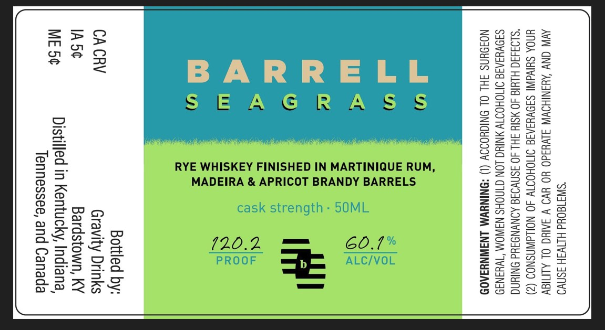

# TTB COLA Label Images - TTBID 26015001000053

**Brand Name:** BARREL SEAGRASS

**Issue Date:** 01/27/2026

**Origin Code:** 22

**Product Class/Type:** 142

**Source:** [TTB Public COLA Registry](https://ttbonline.gov/colasonline/viewColaDetails.do?action=publicFormDisplay&ttbid=26015001000053)

## Label Images

### Label 1

## Extracted Label Text

*Text extracted via OCR - may contain errors*

### Label 1

>

BARRELL

SEAGRAS S§

=

=a

al Oo

pa

RYE WHISKEY FINISHED IN MARTINIQUE RUM,

MADEIRA & APRICOT BRANDY BARRELS

=s>o0

cask strength - 50ML

3352

ax@

c=

o=<

eae

Gon ==

60.7”

PROOF

ALC/VOL

eee}

a7

Db OF

=

=

—
