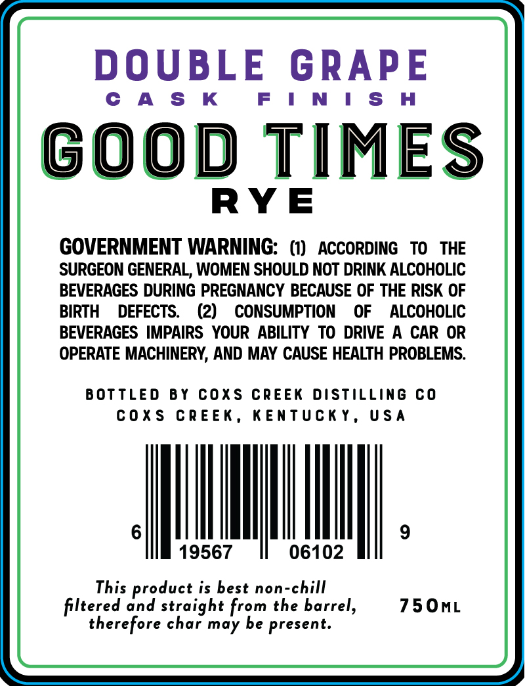
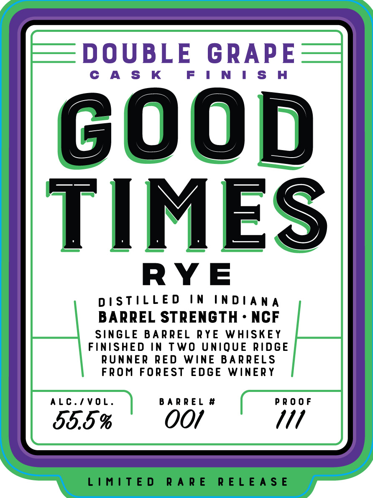

# TTB COLA Label Images - TTBID 26015001000316

**Brand Name:** GOOD TIMES RYE

**Fanciful Name:** DOUBLE GRAPE

**Issue Date:** 01/15/2026

**Origin Code:** 22

**Product Class/Type:** 142

**Source:** [TTB Public COLA Registry](https://ttbonline.gov/colasonline/viewColaDetails.do?action=publicFormDisplay&ttbid=26015001000316)

## Label Images

### Back Label

### Front Label

## Extracted Label Text

*Text extracted via OCR - may contain errors*

### Back Label

DOUBLE GRAPE

CAS K

N

ISH

GOOD TIMES

RYE

GOVERNMENT WARNING: (1) ACCORDING TO THE

SURGEON GENERAL, WOMEN SHOULD NOT DRINK ALCOHOLIC

BEVERAGES DURING PREGNANCY BECAUSE OF THE RISK OF

BIRTH DEFECTS. (2) CONSUMPTION OF ALCOHOLIC

BEVERAGES IMPAIRS YOUR ABILITY TO DRIVE A CAR OR

OPERATE MACHINERY, AND MAY CAUSE HEALTH PROBLEMS.

BOTTLED BY COXS CREEK DISTILLING CO

COXS CREEK, KENTUCKY, USA

MU

|

19567

06102

This product is best non-chill

750mL

filtered and straight from the barrel,

therefore char may be present.

### Front Label

DOUBLE GRAPE

CAS K

FINISH

GOO

TIMES

RYE

DISTILLED IN INDIANA

BARREL STRENGTH - NCF

SINGLE BARREL RYE WHISKEY

FINISHED IN TWO UNIQUE RIDGE

RUNNER RED WINE BARRELS

FROM FOREST EDGE WINERY

ALC./VOL.

BARREL #

PROOF

55.5 %

OO/

111

LIMITED RARE RELEASE
